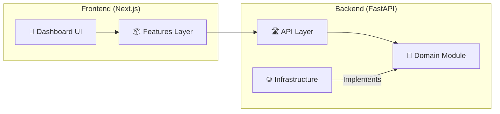

# 🎯 Tracing Objectives Backwards

[](https://www.python.org/downloads/)
[](https://opensource.org/licenses/MIT)
[](docs/concepts/ddd-architecture-guide.md)
[](#technical-architecture)
[](docker-compose.yml)

**Data-Driven Inverse Exploration for Multi-Objective Problems.**

`Tracing-Objectives-Backwards` is a modern, full-stack framework for solving inverse design problems in engineering and data science. By learning the mapping from **Objective Space (Y)** back to **Decision Space (X)**, the system allows users to interactively propose design candidates that match specific performance targets.

---

## 🌟 Key Features

- **🚀 Full-Stack Inverse Pipeline**: A cohesive ecosystem with a **FastAPI** backend and a **Next.js** frontend for seamless data exploration.
- **🐳 Dockerized Deployment**: Fully containerized environment with `docker-compose` for easy setup across any infrastructure.
- **🧠 Model Zoo**: Suite of generative estimators including **GPBI (Global Pareto-Based Inverse)**, MDNs, CVAEs, and INNs for handling one-to-many inverse mappings.
- **🏗️ Enterprise-Grade Architecture**: Built on **Clean Architecture** and **Domain-Driven Design (DDD)** principles for long-term maintainability.
- **📊 Real-time Visualization**: Interactive dashboards to visualize decision and objective spaces simultaneously.

---

## 🔬 Why This Project?

Forward simulation answers: *"Given these design parameters X, what is the outcome Y?"*
In reality, the problem is often reversed: *"Given this desired outcome Y, what parameters X should I use?"*

### The Challenge
Direct inverse mapping is difficult because:
1. **Multi-modality**: Different designs (X) often yield identical outcomes (Y).
2. **Feasibility Boundaries**: Many target outcomes are physically impossible.

### Our Solution
This framework leverages generative modeling to capture the distribution of valid designs and applies industrial-grade architectural patterns to ensure the resulting system is scalable and production-ready.

---

## 🏗️ Technical Architecture

The system follows **Clean Architecture** and **Domain-Driven Design (DDD)** to separate business logic from technical infrastructure.

### System Overview

```mermaid
graph LR
    subgraph "Frontend (Next.js)"
        UI["🎨 Dashboard UI"]
        feat["📦 Features Layer"]
    end

    subgraph "Backend (FastAPI)"
        api["🛣️ API Layer"]
        dom["🧠 Domain Module"]
        inf["🌐 Infrastructure"]
    end

    UI --> feat
    feat --> api
    api --> dom
    inf -- "Implements" --> dom
```

### Architecture Patterns
- **DDD (Domain-Driven Design)**: Business logic is encapsulated within isolated domain modules.
- **Modular Monolith**: Each technical sector (optimization, data, visualization) is a distinct module.
- **Dependency Inversion**: Outer layers (Infra, API) depend on Inner layers (Domain) through interfaces.

---

## 🚦 Quick Start

### 1. The Easy Way (Docker)
Ensure you have [Docker](https://www.docker.com/) installed.
```bash
git clone https://github.com/Nicola-Ibrahim/Pareto-Optimization-.git
cd Pareto-Optimization-
docker-compose up --build
```
Access the **Frontend** at `http://localhost:3000` and the **Backend API** at `http://localhost:8000`.

### 2. Manual Setup
Refer to the individual service READMEs for detailed local setup:
- [Backend Setup](backend/README.md)
- [Frontend Setup](frontend/README.md)

---

## 📖 Documentation Portal

For deep dives into the math, architecture, and API, visit our centralized developer portal:

👉 **[Internal Developer Portal](backend/docs/README.md)**

### Quick Links
- 🏛️ **[DDD & Clean Architecture](backend/docs/concepts/ddd-architecture-guide.md)**: How we structure the codebase.
- 🧬 **[Inverse Design Pipeline](backend/docs/processes/inverse-design-pipeline.md)**: The mathematical core of the project.
- 🔄 **[Synthesis & Exploration Loop](backend/docs/concepts/synthesis-exploration-loop.md)**: The theoretical interaction model.

---

## 📄 License

MIT License - see [LICENSE](LICENSE).
