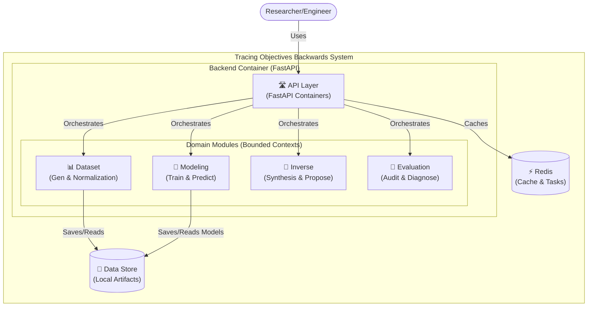

# 🎯 Tracing Objectives Backwards (Backend & Infrastructure)

[](https://www.python.org/downloads/)
[](https://fastapi.tiangolo.com/)
[](https://pytorch.org/)
[](docker-compose.prod.yml)
[](https://github.com/astral-sh/ruff)
[](LICENSE)

**High-Performance AI Orchestrator for Multi-Objective Optimization.**

This repository contains the mathematical engine, REST API, and deployment infrastructure for **Tracing Objectives Backwards**. Built with **FastAPI** and **PyTorch**, it provides the foundation for inverse exploration, surrogate training, and reliability auditing.

---

## 🏛️ System Architecture (C4 Container View)

The system is designed as a **Modular Domain Monolith** following **Clean Architecture**. The API layer acts as a thin orchestrator for highly isolated core domain modules.


```mermaid
graph TD
    User([Researcher/Engineer])
    
    subgraph "Tracing Objectives Backwards System"
        subgraph "Backend Container (FastAPI)"
            API["🛣️ API Layer<br/>(FastAPI Containers)"]
            
            subgraph "Domain Modules (Bounded Contexts)"
                Dataset["📊 Dataset<br/>(Gen & Normalization)"]
                Modeling["🧠 Modeling<br/>(Train & Predict)"]
                Inverse["🔄 Inverse<br/>(Synthesis & Propose)"]
                Evaluation["🔬 Evaluation<br/>(Audit & Diagnose)"]
            end
        end
        
        FileSystem[("📂 Data Store<br/>(Local Artifacts)")]
        RedisStore[("⚡ Redis<br/>(Cache & Tasks)")]
    end

    User -->|Uses| API
    API -->|Orchestrates| Dataset
    API -->|Orchestrates| Modeling
    API -->|Orchestrates| Inverse
    API -->|Orchestrates| Evaluation
    
    API -->|Caches| RedisStore

    Dataset -->|Saves/Reads| FileSystem
    Modeling -->|Saves/Reads Models| FileSystem
```

---

## 🧬 Core Domain Modules

Each module is an isolated **Bounded Context** with its own Domain and Infrastructure layers:

- **`📊 dataset`**: Handles simulation of raw Pareto-optimal data (using `pymoo`). Manages the lifecycle of ground-truth datasets and ensures consistent normalization for AI training.
- **`🧠 modeling`**: The heart of the surrogate engine. Implementations for **MDNs (Mixture Density Networks)**, **CVAEs**, and custom **GPBI** algorithms using PyTorch.
- **`🔄 inverse`**: Implements the synthesis logic. Uses trained surrogates to propose design candidates (X) that match target objectives (Y), solving the complex one-to-many mapping problem.
- **`🔬 evaluation`**: The "Auditor". Runs comprehensive diagnostics like **PIT (Probability Integral Transform)**, **MACE**, and Diversity audits to ensure model trustworthiness.

---

## 🚦 Development Workflow

We use automated scripts to manage your local environment and secret synchronization.

### 1. One-Time Setup
Installs all core tools (`uv`, `doppler`, etc.) and prepares your path.
```bash
python3 scripts/bootstrap.py
```

### 2. Daily Start (The Morning Routine) ☕
The automated orchestrator for your daily workspace. It performs the "heavy lifting" by:
1. **Dependency Sync**: Ensuring your local `uv` environment is locked and updated.
2. **Infrastructure Boot**: Launching the core service stack (`redis`, `nginx`) using **Docker Compose** in the background.
3. **Environment Tabs**: Automatically launching your dev servers in individual terminal tabs for immediate visibility.
```bash
python3 scripts/setup_dev.py
```

### 3. The Shutdown Routine 🌙
Run this to gracefully terminate your session. It stops services and cleans up temporary runtime artifacts.
```bash
# Standard shutdown
python3 scripts/shutdown_dev.py

# Deep clean (wipes Docker volumes and all build caches)
python3 scripts/shutdown_dev.py --clean
```

### 4. Reset & Sync
If secrets change or your environment feels "stale," run this to refresh Doppler secrets and flush Redis.
```bash
python3 scripts/init_env.py
```

---

## 🛠️ Infrastructure & Setup

### Pre-flight Checks
1. **Secrets**: Ensure you are logged into Doppler: `doppler login`.
2. **Environment**: If you are not using Doppler, copy `.env.example` to `.env` and fill in your local values.

### Endpoint Overview
- **REST API**: `http://localhost:8000` (FastAPI)
- **Interactive Docs**: `http://localhost:8000/docs` (Swagger UI)
- **Monitoring**: Redis and Nginx logs are accessible via the terminal tabs launched by `setup_dev.py`.

### 🧪 Code Quality (Poe)
We use `poethepoet` for standard maintenance:
- `uv run poe check`: One-tap suite running lint, format, and tests.
- `uv run poe test`: Execute the pytest-based suite.
- `uv run poe test-cov`: Run tests with coverage reports.
- `uv run poe lint`: Run code quality checks (Ruff).
- `uv run poe format`: Auto-format code.

---

## 📖 Internal Documentation

For a deeper look into the patterns and mathematics of the engine:
- 🏛️ **[Central DDD Guide](docs/concepts/ddd-architecture-guide.md)**
- 🧬 **[Inverse Design Theory](docs/processes/inverse-design-pipeline.md)**
- 🧭 **[Developer Portal](docs/README.md)**
- 📖 **[Technical Glossary](docs/GLOSSARY.md)**

---

Related: [Frontend Repository](https://github.com/Nicola-Ibrahim/Tracing-Objectives-Backwards-Frontend) *(Separate Repo)*
