# 🎯 Tracing Objectives Backwards

[](https://www.python.org/downloads/)
[](https://opensource.org/licenses/MIT)
[](docs/concepts/ddd-architecture-guide.md)
[](docs/specs/design.md)

**Data-Driven Inverse Exploration for Multi-Objective Problems.**

This project implements a sophisticated inverse design framework: learning a mapping from **Objective Space (Y)** back to **Decision Space (X)**. It enables engineers to propose candidate designs that precisely match user-specified performance targets without the cost of repeated full optimizations.

---

## 🌟 Key Features

- **🚀 Inverse Exploration Workflow**: Formalized pipeline for multi-objective problems with offline training and online interactive querying.
- **🧠 Model Zoo**: Suite of estimators including Deterministic Regressors, Mixture Density Networks (MDN), Conditional VAEs (CVAE), and Invertible Neural Networks (INN).
- **🛡️ Feasibility & Validation**: Multi-layer validation (Pareto proximity, distance-based feasibility, and calibration gates) to ensure trustworthy design proposals.
- **📊 Visualization Suite**: High-impact diagnostics for datasets, model performance, and Pareto analysis.
- **🏗️ Industrial Grade Architecture**: Modular Monolith following Domain-Driven Design (DDD) principles for maximum maintainability and testability.

---

## 🔬 Why This Project?

Forward simulation answers: *"Given these design parameters X, what is the outcome Y?"*
In reality, the problem is often reversed: *"Given this desired outcome Y*, what parameters X should I use?"*

### The Challenge
Direct inverse mapping is notoriously difficult because:
1.  **Ill-posedness**: Multiple designs (X) can yield the same outcome (Y).
2.  **Infeasibility**: Many target outcomes are physically or mathematically impossible.
3.  **Stability**: Small changes in targets can lead to radical shifts in design.

### Our Solution
This framework addresses these by learning the **Inverse Decision Mapping** from historical Pareto-optimal data, utilizing generative modeling for one-to-many mappings, and applying strict feasibility filters.

---

## 🏗️ Technical Architecture

The system is built as a **Modular Monolith** with clear separation of concerns in a layered DDD structure.

```mermaid
graph TD
    subgraph "External Layers"
        CLI["💻 CLI Entrypoints"]
        NB["📓 Notebooks"]
    end

    subgraph "Core Engine (src/modules/optimization_engine)"
        APP["⚙️ Application Layer<br/>(Use Cases & Orchestration)"]
        DOM["🧠 Domain Layer<br/>(Business Rules & Entities)"]
        INF["🌐 Infrastructure Layer<br/>(ML Adapters, Repositories)"]
    end

    CLI --> APP
    NB --> APP
    APP --> DOM
    INF -- Implements Interfaces --> DOM
    APP --> INF
```



---

## 🚦 Quick Start

### 1. Prerequisites
- Python 3.12+
- [uv](https://github.com/astral-sh/uv) (recommended)

### 2. Setup
```bash
# Clone the repository
git clone https://github.com/Nicola-Ibrahim/Pareto-Optimization-.git
cd Pareto-Optimization-

# Sync dependencies
uv sync
```

### 3. Basic Workflow
```bash
# Generate a Pareto-optimal dataset (e.g., COCO Function 5)
make data-generate function-id=5

# Train an inverse MDN model
make model-train-inverse estimator=mdn dataset-name=cocoex_f5

# Generate design candidates for a target
make model-generate-decision target="[0.5, 0.5]"
```

---

## 📖 Documentation Index

| Guide | Description |
|-------|-------------|
| 🧭 **[Developer Portal](docs/README.md)** | Start here for a full index of all project docs. |
| 🛠️ **[Usage & Building](docs/guide/usage.md)** | Comprehensive setup and CLI execution guide. |
| 🧬 **[Inverse Pipeline](docs/processes/inverse-design-pipeline.md)** | Deep dive into the mathematical and logical flow. |
| 🏛️ **[DDD Architecture](docs/concepts/ddd-architecture-guide.md)** | Detailed explanation of the modular monolith design. |
| 🔬 **[Model Specs](docs/modeling/mdn.md)** | Documentation for MDN, CVAE, and INN models. |

---

## 🎓 Thesis Context

This repository supports the thesis: **"Tracing the Objectives Backwards: Data-Driven Inverse Exploration of Multi-Objective Problems."** It provides the reference implementation for the proposed model-agnostic inverse exploration workflow.

---

## 📄 License

This project is licensed under the MIT License - see the [LICENSE](LICENSE) file for details.
