# Tracing Objectives Backwards

This project implements a data-driven inverse design framework: learn a mapping from objective space **Y** back to decision space **X**, then use it to propose candidate designs that match a user-specified target objective **Y\***. The focus is **inverse decision mapping** in multi-objective settings, where multiple designs can satisfy the same objective pattern and feasibility must be assessed explicitly.

## Why this exists

Forward simulation answers **X -> Y**. In practice, engineers often need the inverse: **given a target outcome Y\***, what **X** could produce it? This inverse problem is typically ill-posed (one-to-many, unstable, or infeasible). The thesis and codebase formalize a practical workflow that:

- Learns a fast inverse mapper **g: Y -> X** from historical Pareto-optimal data.
- Provides feasibility guidance when targets fall outside the observed Pareto region.
- Supports deterministic and probabilistic inverse models to handle one-to-many mappings.
- Validates candidate decisions via forward checks and ranking in objective space.

## What this project delivers

- **Inverse exploration workflow** for multi-objective problems, with offline training and online querying.
- **Model zoo** spanning deterministic regressors and probabilistic/generative models (e.g., MDN, CVAE, INN).
- **Feasibility and decision validation** (e.g., Pareto proximity, distance-based feasibility, calibration gates).
- **Data generation and evaluation** using synthetic benchmarks (COCO) and domain-specific case studies.
- **Visualization tooling** for datasets, diagnostics, and model comparisons.

## Conceptual pipeline (high level)

1. **Generate or collect Pareto-optimal data** (X, Y).
2. **Train inverse mapper**: learn g such that g(Y) ~= X.
3. **Query-time inverse exploration**:
   - User selects target objective **Y\***.
   - System checks feasibility (bounds + Pareto proximity).
   - Inverse model generates candidate **X\***.
   - Forward check ranks candidates by how well f(X\*) matches Y\*.

## System framework

```mermaid
%%{init: {
  "theme": "default",
  "themeVariables": {
    "fontFamily": "Inter, Arial, sans-serif",
    "fontSize": "18px",
    "primaryColor": "#E7F6FF",
    "primaryBorderColor": "#0091EA",
    "primaryTextColor": "#1976D2",
    "nodeBorder": "#80D8FF",
    "edgeLabelBackground": "#FCFCFC",
    "clusterBkg": "#F3F8FC",
    "lineColor": "#607D8B"
  },
  "flowchart": {
    "curve": "basis",
    "padding": 20,
    "nodeSpacing": 50,
    "rankSpacing": 90
  }
}}%%

flowchart TD
 subgraph Offline["<b>🧰 Offline: Mapper Training</b>"]
    direction TB
        acceptData["📥<br><b>Accept Pareto Points</b><br>(experiments or simulation)"]
        dataPreparation["🧹<br><b>Data Preparation</b>"]
        trainInverseMapper["🧠<br><b>Train Inverse Mapper</b><br>(Y → X̂)"]
        inverseMapperModel(["📦<br><b>Validated Inverse Mapper</b>"])
  end

 subgraph Online["<b>💡 Online: User Interaction</b>"]
    direction TB
        defineTargetObjective("🎯<br><b>Define Target Objective (Y*)</b>")
        paretoGuidance{"📊<br><b>Pareto Region Guidance</b><br>How close is Y* to Pareto Front?"}
        nearPareto(["🟢<br><b>Y* is Near Pareto Front</b>"])
        farPareto(["🔵<br><b>Y* is Far Preto <br>Suggest Refinement or Proceed</b>"])
        generateCandidates["🔁<br><b>Generate Candidate(s) X̂"]
        forwardCheck{"🔎<br><b>Forward Check:<br>Does X̂ → Ŷ ≈ Y*?</b>"}
        rankCandidates["📊<br><b>Rank / Select Best Candidate(s)</b>"]
        userFeedback[["👤🔄<br><b>User Feedback &amp; Refinement</b>"]]
  end

 subgraph SYS["<b>🧠 AI-Based Inverse Mapping System</b>"]
    direction TB
        Offline
        forwardMapperModel["🧮<br><b>Forward Mapper<br>(X → Y)</b>"]
        Online
  end

    %% Edges with labels
    acceptData -->|Preprocessing| dataPreparation
    dataPreparation -->|Clean Data| trainInverseMapper
    trainInverseMapper -->|Validate & Export| inverseMapperModel

    defineTargetObjective -->|Target Defined| paretoGuidance
    paretoGuidance -- Yes --> nearPareto
    paretoGuidance -- No --> farPareto

    inverseMapperModel -->|Inference Model Loaded| generateCandidates
    nearPareto -->|Use Target| generateCandidates
    farPareto -->|Proceed Anyway| generateCandidates
    farPareto -->|Refine Target| defineTargetObjective

    generateCandidates -->|"Candidate(s) X̂"| forwardCheck
    forwardCheck -->|Validated Candidates & Metrics| rankCandidates
    rankCandidates --> userFeedback
    userFeedback -.->|Adjust Y*| defineTargetObjective

    forwardMapperModel -->|Validate against| forwardCheck

    %% Class Styles
    classDef objective fill:#FFFBE5,stroke:#FFC107,stroke-width:3px,color:#333
    classDef inputdata fill:#E0E0E0,stroke:#757575,stroke-width:2px,color:#333
    classDef training fill:#C8E6C9,stroke:#4CAF50,stroke-width:3px,color:#2E7D32
    classDef decision fill:#BBDEFB,stroke:#2196F3,stroke-width:3px,color:#1976D2
    classDef feasible fill:#E8F5E9,stroke:#43A047,stroke-width:2.5px,color:#2E7D32
    classDef farregion fill:#E3F2FD,stroke:#64B5F6,stroke-width:2.5px,color:#1976D2
    classDef processrun fill:#E0F2F7,stroke:#00BCD4,stroke-width:2px,color:#0097A7
    classDef validation fill:#FCE4EC,stroke:#E91E63,stroke-width:2.5px,color:#AD1457
    classDef forwardmodel fill:#CFD8DC,stroke:#607D8B,stroke-width:2px,color:#424242
    classDef feedback fill:#FFEBEE,stroke:#F44336,stroke-width:2.2px,color:#C62828
    classDef preprocessing fill:#E3F2FD,stroke:#42A5F5,stroke-width:2px,color:#1E88E5
    classDef model_ready fill:#EDE7F6,stroke:#7B1FA2,stroke-width:3px,color:#311B92

    class defineTargetObjective objective;
    class acceptData inputdata;
    class dataPreparation preprocessing;
    class trainInverseMapper training;
    class inverseMapperModel model_ready;
    class paretoGuidance decision;
    class nearPareto feasible;
    class farPareto farregion;
    class generateCandidates processrun;
    class rankCandidates processrun;
    class forwardCheck validation;
    class userFeedback feedback;
    class forwardMapperModel forwardmodel;

    style Offline fill:#EEF8EE,stroke:#2E7D32,stroke-width:2px
    style Online fill:#E1F5FE,stroke:#039BE5,stroke-width:2px
    style SYS fill:#F5FAFF,stroke:#14B4F4,stroke-width:3px
```

Diagram source: `docs/processes/system-framework.md`.

## Where to start

- System overview: `docs/processes/system-framework.md`
- Inverse design pipeline: `docs/processes/inverse-design-pipeline.md`
- Model training & validation: `docs/processes/model-training-validation.md`
- MDN-based inverse mapping flow: `docs/modeling/mdn-inverse-mapping-process.md`
- Additional modeling notes: `docs/modeling/vae.md`, `docs/modeling/nsga2-optimization.md`

## Project structure (high level)

- `src/`: core inverse mapping system (DDD-style domain/app/infra layers)
- `docs/`: process diagrams, modeling notes, and system specifications
- `notebooks/`: exploratory analysis, training, and visualization notebooks
- `models/`, `reports/`: artifacts and outputs (when generated)

## Thesis alignment

This repository supports the thesis **"Tracing the Objectives Backwards: Data-Driven Inverse Exploration of Multi-Objective Problems."** The core contribution is a model-agnostic inverse exploration workflow that learns **Y -> X** mappings from forward evaluations and enables interactive, query-time design without re-running optimization for every target.
