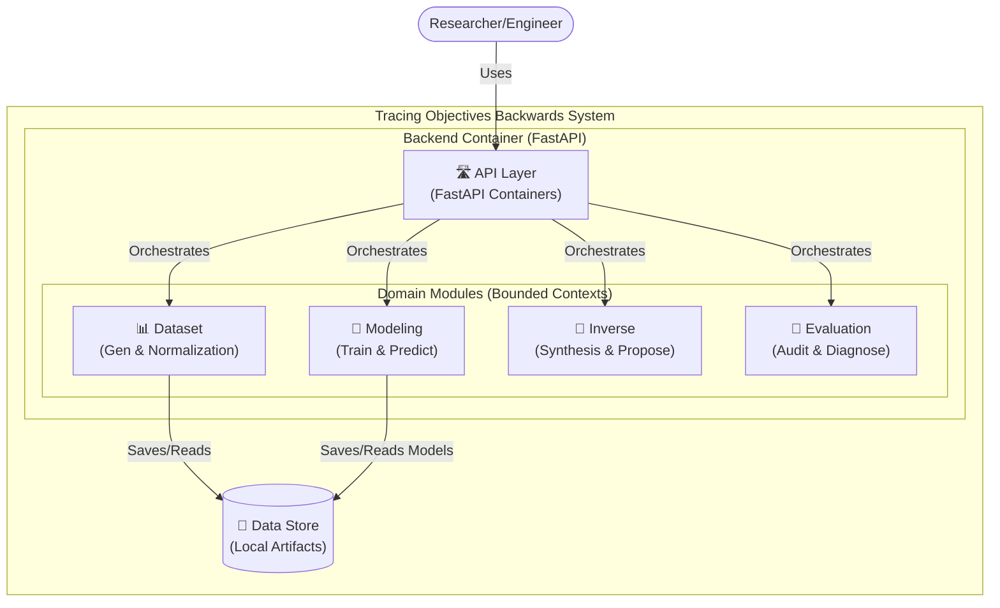

# 🚀 Backend: Inverse Mapping Engine

[](https://www.python.org/downloads/)
[](https://fastapi.tiangolo.com/)
[](https://pytorch.org/)
[](Dockerfile)
[](https://github.com/astral-sh/ruff)

This is the high-performance AI engine for **Tracing Objectives Backwards**. Built with **FastAPI** and **PyTorch**, it provides the mathematical foundation for inverse exploration, training sophisticated surrogates, and auditing their reliability.

---

## 🏛️ System Architecture (C4 Container View)

The backend is structured as a **Modular Monolith** following **Clean Architecture**. The API layer acts as a thin orchestrator for the core domain modules.



---

## 🧬 Core Domain Modules

Each module is an isolated **Bounded Context** with its own Domain and Infrastructure layers.

- **`📊 dataset`**: Handles simulation of raw Pareto-optimal data. It manages the lifecycle of ground-truth datasets and ensures consistent normalization for AI training.
- **`🧠 modeling`**: The heart of the surrogate engine. It contains implementations for **MDNs (Mixture Density Networks)**, **CVAEs**, and the custom **GPBI** algorithm. We chose PyTorch for its dynamic computational graphs, essential for custom loss functions.
- **`🔄 inverse`**: Implements the synthesis logic. It uses trained models to propose design candidates (X) that match target objectives (Y), handling the one-to-many mapping challenge.
- **`🔬 evaluation`**: The "Auditor". It runs comprehensive diagnostics like **PIT (Probability Integral Transform)**, **MACE**, and Diversity audits to ensure model trustworthiness.

---

## 🛠️ Technical Specifications

### 🚦 Quick Start (Local)

#### Prerequisites
- [uv](https://github.com/astral-sh/uv) (Recommended) or `pip`

#### Installation
```bash
uv sync
```

#### Development Server
```bash
uv run fastapi dev src/api/main.py
```

### 🐳 Dockerization

To run the backend as a standalone container:

**1. Build the image:**
```bash
docker build -t tob-backend .
```

**2. Run the container:**
```bash
docker run -p 8000:8000 tob-backend
```

### 🧪 CLI Tools (Poe)
We use `poethepoet` to manage common development tasks:
- `uv run poe train-inv`: Launch inverse model training.
- `uv run poe diagnose`: Run the full auditor suite on trained models.
- `uv run poe test`: Execute the pytest-based test suite.

---

## 📖 Extended Knowledge

For a deeper look into the patterns and math:
- 🏛️ **[Central DDD Guide](../docs/concepts/ddd-architecture-guide.md)**
- 🧬 **[Inverse Design Theory](../docs/processes/inverse-design-pipeline.md)**
- 🧭 **[Developer Portal](../docs/README.md)**

---
Related: [Root README](../README.md) | [Frontend README](../frontend/README.md)
