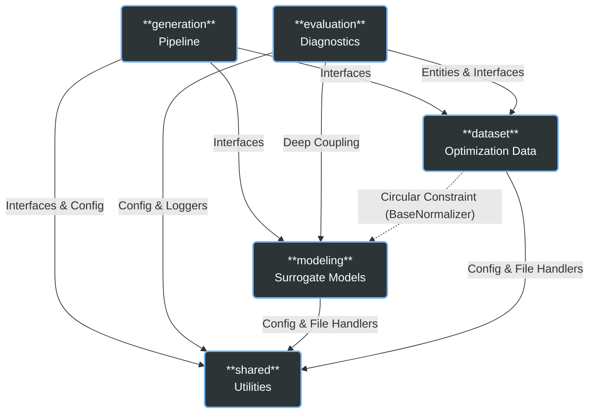

# Domain Architecture: System Overview

Welcome to the domain architecture documentation for **Tracing Objectives Backwards**. This project follows a Modular Monolith architecture using Domain-Driven Design (DDD) principles.

## Quick Links

- [dataset](dataset.md): Optimization data generation and processing
- [modeling](modeling.md): Surrogate model training and evaluation
- [evaluation](evaluation.md): Diagnostic lenses and feasibility checks
- [generation](generation.md): Coherent candidate generation pipeline
- [shared](shared.md): Cross-cutting utilities
- [integration](integration.md): Cross-module dependencies and known debt

---

## 🏗 System Architecture & Module Dependencies

The system is organized into five isolated bounded contexts (modules). The diagram below illustrates their high-level dependencies.

---

## 🗂 Module Responsibilities

| Module | Bounded Context | Aggregate Root(s) | Domain Language | Key Responsibility |
|--------|-----------------|-------------------|-----------------|--------------------|
| [**dataset**](dataset.md) | Data Generation & Preparation | `Dataset` | Objective, Decision, Pareto Front, Algorithm, Problem | Generates ground-truth optimization data, normalizes it, and splits it into training/testing sets. |
| [**modeling**](modeling.md) | Surrogate Function Approximation | `ModelArtifact` | Estimator, Metrics, Cross-Validation, Artifact | Trains, tunes, evaluates, and persists machine learning models capable of predicting objectives from decisions (forward) or vice versa (inverse). |
| [**evaluation**](evaluation.md) | Generative Diagnostics | `DiagnosticResult` | Accuracy, Reliability, Feasibility, Calibration, Pareto Proximity | Audits the quality of generated candidates and models using spatial discrepancy, distribution divergence, and domain constraints. |
| [**generation**](generation.md) | Coherent Candidate Synthesis | `CoherenceContext` | Mesh, Anchor, Barycentric Weight, Trust-Region | Generates physically coherent design candidates for specified target objectives using geometric meshing and surrogate-assisted optimization. |
| [**shared**](shared.md) | Cross-Cutting Concerns | N/A | Logger, Config, File Handler | Provides horizontal services like logging, path resolution, and generalized serialization that all modules consume. |

---

## 🔄 End-to-End Data Flow

The lifecycle of an optimization task flows through the modules sequentially:

1. **Problem Definition (`dataset`)**: A mathematical objective function (e.g., BiObj, Electric Vehicle) is defined.
2. **Data Generation (`dataset`)**: An evolutionary algorithm (e.g., NSGA-II) runs to generate a representative `Dataset` with raw decisions, objectives, and a Pareto front.
3. **Model Training (`modeling`)**: The dataset is used to train surrogates (Forward/Inverse models). The models and their metrics are serialized as `ModelArtifact`s.
4. **Model Diagnosis (`evaluation`)**: The trained inverse models are rigorously audited for spatial accuracy and generative reliability. 
5. **Candidate Generation (`generation`)**: For a new target objective, the `generation` pipeline locates an interpolation region on the objective-space mesh and samples coherent variations, or falls back to trust-region optimization to suggest entirely novel configurations.

---

## 🥞 DDD Layer Legend

Each module strictly follows a three-tier DDD architecture internally:

| Layer | Files | Description |
|-------|-------|-------------|
| **Domain** | `/domain` | Pure business logic. Entities, value objects, domain services, interfaces (ports). No external dependencies. |
| **Application** | `/application` | Orchestrates use cases. Factories, use case services. Depends only on the domain layer. |
| **Infrastructure** | `/infrastructure` | Concrete implementations. Repositories (adapters), specific ML algorithms, file I/O operations. |
