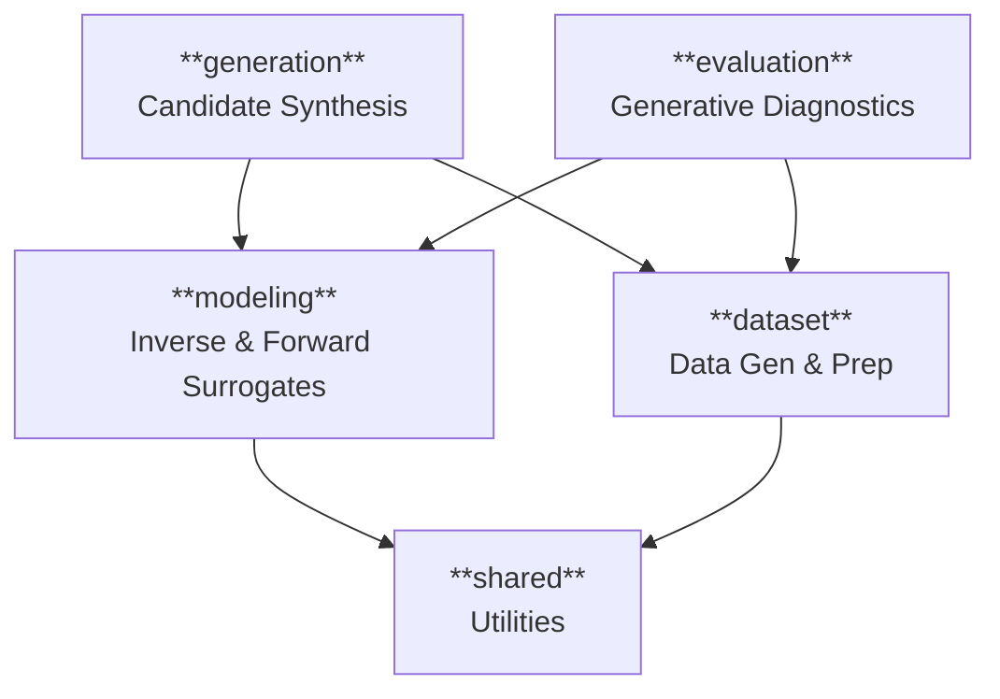

# 🏛️ System Architecture Blueprint

This document provides the high-level structural overview of **Tracing Objectives Backwards**. For the underlying theory of why we use this structure, see the **[DDD & Clean Architecture Guide](../concepts/ddd-architecture-guide.md)**.

---

## 🗺️ Module Topology

The system is organized into isolated **Bounded Contexts**. Each module is self-contained and communicates through well-defined interfaces.

---

## 🗂️ Core Modules

| Module | Responsibility | Key Aggregate |
| :--- | :--- | :--- |
| **[dataset](dataset.md)** | Generates and normalizes Pareto-optimal data. | `Dataset` |
| **[modeling](modeling.md)** | Trains agents (MDN, GPBI, etc.) to learn mappings. | `ModelArtifact` |
| **[evaluation](evaluation.md)** | Audits accuracy and reliability of surrogates. | `DiagnosticResult` |
| **[generation](generation.md)** | Proposes coherent designs using local localization. | `CoherenceContext` |
| **[shared](shared.md)** | Foundational utilities (Loggers, File Handlers). | N/A |

---

## 🔄 The Reference Workflow

1.  **Define**: Pick a problem (BiObj, EV) in `dataset`.
2.  **Simulate**: Generate ground truth Pareto data.
3.  **Learn**: Train an inverse model (e.g., **GPBI**) in `modeling`.
4.  **Audit**: Verify the model's reliability in `evaluation`.
5.  **Propose**: Generate design candidates in `generation`.

---

## 🕸️ Integration Standards
We maintain strict boundaries to prevent "Spaghetti Code". For a list of known technical debt and integration rules, see **[Integration & Dependencies](integration.md)**.
