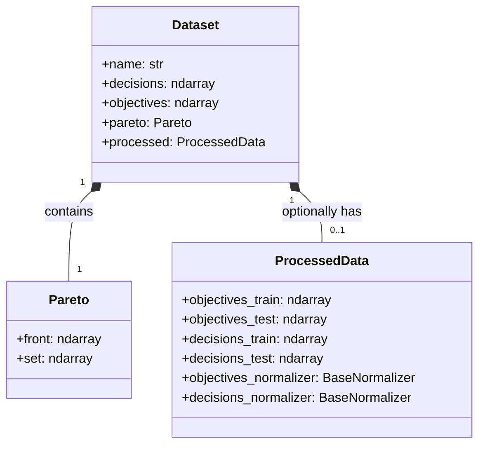

← [Back to Overview](README.md)

# 📊 Dataset Module

**Bounded Context**: Data Generation & Preparation  
**Aggregate Root**: `Dataset`

The `dataset` module is responsible for defining mathematical optimization problems (like BiObj or Electric Vehicle), running evolutionary algorithms to solve them, generating the true Pareto front, and preparing datasets (split, normalized) for surrogate modeling.

## 🏗️ Architectural Pattern

This module follows the **Clean Architecture** patterns defined in our **[DDD Guide](../concepts/ddd-architecture-guide.md)**.

### Layer Mapping
- **Domain**: Core Pareto dominance rules and dataset entities (`Dataset`, `Pareto`).
- **Application**: Context preparation and generation services.
- **Infrastructure**: Pymoo adapters and filesystem repositories.

## 📦 Component Inventory

| Layer | Type | Component | Description |
|-------|------|-----------|-------------|
| **Domain** | Entity | `Dataset` | Aggregate root storing raw decisions, objectives, and optional processed data. |
| **Domain** | Entity | `ProcessedData` | Split (train/test) and normalized version of a dataset. |
| **Domain** | Value | `Pareto` | Stores the mathematically derived Pareto front and optimal set. |
| **Domain** | Service | `DatasetGenerationService` | Orchestrates the generation of a dataset from a problem. |
| **Domain** | Interface | `BaseDataSource` | Defines the generic data ingestion contract. |
| **Domain** | Interface | `BaseRepository` | Persistence contract for datasets. |
| **App** | Factory | `AlgorithmFactory` | Constructs specific algorithms (like NSGA-II). |
| **App** | Use Case | `generation` | End-to-end script orchestrating the `DatasetGenerationService`. |
| **Infra** | Adapter | `OptimizationDataSource` | Wraps pymoo pipeline into a BaseDataSource. |
| **Infra** | Interface | `BaseProblem`, `BaseAlgorithm`, `BaseOptimizer` | Framework-specific optimization contracts. |
| **Infra** | Repo | `FileSystemDatasetRepository` | Saves datasets to JSON/NPZ on the local file system. |
| **Infra** | Visual | `Plotly Visualizer` | Concrete implementation of dataset visualizations. |

## 🔗 Entity Relationships

## 🔄 Data Flow

1. **Definition**: A `BaseProblem` is defined mathematically.
2. **Solving**: A `BaseAlgorithm` (e.g., NSGA-II) runs on the problem to generate raw candidates and derive the raw `Pareto` optimal boundary.
3. **Packaging**: The raw targets are bundled into the `Dataset` aggregate root.
4. **Processing**: Normalization scaling applies to the features via `BaseNormalizer`, and indices are randomly split into train/test pools, encapsulated in a `ProcessedData` entity child.
5. **Storage**: The dataset is serialized securely locally via the `FileSystemDatasetRepository`.

---
Related: [modeling](modeling.md) | [evaluation](evaluation.md)
