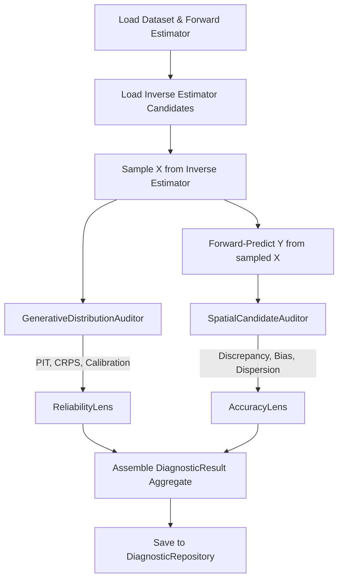

← [Back to Overview](README.md)

# ⚖️ Evaluation Module

**Bounded Context**: Generative Diagnostics  
**Aggregate Root**: `DiagnosticResult`

The `evaluation` module is the most complex bounded context in the system. It contains three distinct sub-contexts: **core diagnostics** (accuracy and reliability of surrogates), **decision validation** (out-of-distribution detection), and **feasibility** (constraint satisfaction and Pareto proximity).

## 🏗️ Architectural Pattern

This module follows the **Clean Architecture** patterns defined in our **[DDD Guide](../concepts/ddd-architecture-guide.md)**.

### Sub-Context Mapping
- **Core**: Surrogate accuracy and reliability diagnostics.
- **Validation**: Out-of-distribution (OOD) decision detection.
- **Feasibility**: Geometric Pareto proximity policies.

## 📦 Component Inventory

### Core Diagnostics

| Layer | Type | Component | Description |
|-------|------|-----------|-------------|
| **Domain** | Entity | `DiagnosticResult` | Aggregate root storing the complete audit of an estimator for a dataset. |
| **Domain** | Entity | `AccuracyLens` | Objective-space spatial discrepancy metrics (Euclidean distance, best-shot). |
| **Domain** | Entity | `ReliabilityLens` | Decision-space distribution metrics (PIT, CRPS, Calibration Error). |
| **Domain** | Service | `SpatialCandidateAuditor` | Computes distances between generated candidates and reference targets. |
| **Domain** | Service | `GenerativeDistributionAuditor` | Computes statistical metrics comparing generated distributions vs ground truth. |
| **App** | Use Case | `diagnose_models` | End-to-end pipeline running full suite of metrics on inverse models. |
| **App** | Use Case | `compare_candidates` | Generates candidates across multiple inverse models and visualizes comparison. |

### Decision Validation Sub-Context

| Layer | Type | Component | Description |
|-------|------|-----------|-------------|
| **Domain** | Entity | `DecisionValidationCalibration` | Calibration thresholds (e.g., Mahalanobis distance cutoffs). |
| **Domain** | Entity | `GeneratedDecisionValidationReport` | Results of validating AI-generated decisions. |
| **Domain** | Enum | `Verdict` | `ACCEPT` \| `REJECT` \| `WARNING` \| `ABSTAIN` |
| **Domain** | Interface | `BaseValidator` | Contract for OOD detection mechanisms. |
| **Infra** | Validator | Mahalanobis, Split Conformal L2 | Concrete out-of-distribution detectors. |

### Feasibility Sub-Context

| Layer | Type | Component | Description |
|-------|------|-----------|-------------|
| **Domain** | Entity | `FeasibilityAssessment` | Overall rating of whether an objective is feasible. |
| **Domain** | Entity | `AssessmentFinding` | Specific warnings/failures (e.g., "Outside historical range"). |
| **Domain** | Value | `ParetoFront`, `Suggestions` | Derived constraint boundaries and fallback ideas. |
| **Domain** | Service | `ObjectiveFeasibilityService` | Runs target objectives through policy validators. |
| **Domain** | Policy | `HistoricalRangeValidator` | Asserts objectives don't violate known absolute min/max bounds. |
| **Domain** | Policy | `ParetoProximityValidator` | Asserts objectives aren't utopic (beyond the Pareto front). |

## 🔄 Diagnostic Service Flow

---
Related: [modeling](modeling.md) | [integration](integration.md)
