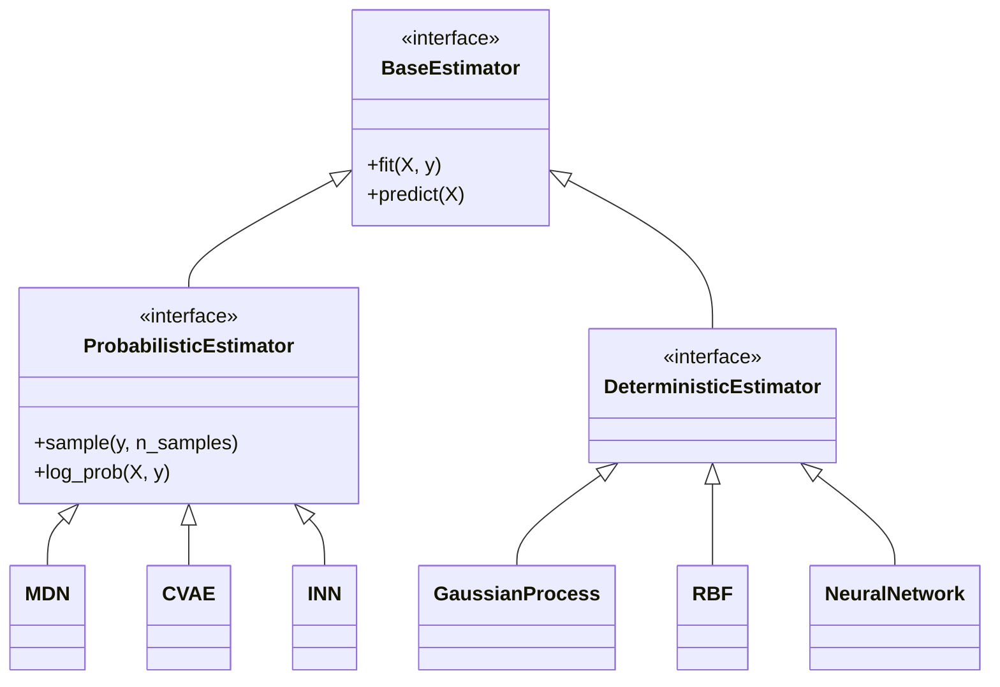
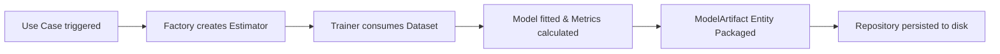

← [Back to Overview](README.md)

# 🧠 Modeling Module

**Bounded Context**: Surrogate Function Approximation  
**Aggregate Root**: `ModelArtifact`

The `modeling` module handles training, hyperparameter tuning, evaluation, and persistence of forward (decisions → objectives) and inverse (objectives → decisions) surrogate models. It supports both deterministic (e.g., GP, RBF, NN) and probabilistic (e.g., MDN, CVAE, INN) architectures.

## 🥞 DDD Architecture

```mermaid
flowchart LR
    subgraph Domain ["Domain Layer (Core Logic)"]
        direction TB
        E[ModelArtifact] 
        VO[EstimatorParamsBase<br/>Metrics]
        I[BaseEstimator<br/>BaseNormalizer]
        I2[BaseModelArtifactRepository]
        S[CrossValidationTrainer<br/>DeterministicTrainer<br/>ProbabilisticTrainer]
    end

    subgraph Application ["Application Layer (Use Cases)"]
        direction TB
        F[EstimatorFactory<br/>MetricFactory<br/>NormalizerFactory]
        R[EstimatorRegistry]
        U[Train Forward/Inverse<br/>Generate Candidates]
    end

    subgraph Infrastructure ["Infrastructure Layer (Details)"]
        direction TB
        D[RBF, GP, NN, KNN]
        P[MDN, CVAE, INN]
        M[Concrete Metrics]
        N[Standard, MinMax Normalizers]
        Repo[FileSystemModelArtifactRepository]
    end

    Infrastructure -->|Implements Interfaces| Domain
    Application -->|Coordinates| Domain
    Infrastructure -->|Used by| Application

    classDef env fill:#fff,stroke:#333,stroke-width:2px,color:#000;
    class Domain,Application,Infrastructure env;
```

## 📦 Component Inventory

| Layer | Type | Component | Description |
|-------|------|-----------|-------------|
| **Domain** | Entity | `ModelArtifact` | Aggregate root tying a trained estimator, its metrics, and lineage together. |
| **Domain** | Value | `Metrics` / `EstimatorParamsBase` | Config and performance artifacts. |
| **Domain** | Interface | `BaseEstimator` | Contract for all models (`predict`, `sample`). |
| **Domain** | Interface | `BaseModelArtifactRepository` | Pattern for persisting and reading trained estimators. |
| **Domain** | Service | `CrossValidationTrainer` | Drives multi-fold k-split training sequences. |
| **App** | Factory | `EstimatorFactory` | Generates specific ML estimator instances dynamically via `EstimatorRegistry`. |
| **App** | Use Case | `train_forward_model` | Automates end-to-end forward training. |
| **App** | Use Case | `train_inverse_model` | Automates end-to-end inverse training. |
| **Infra** | ML | Deterministic Estimators | Concrete regression classes (RBF, GP, NN, Nearest Neighbors). |
| **Infra** | ML | Probabilistic Estimators | Generative models handling non-uniqueness (MDN, CVAE, INN). |
| **Infra** | Repo | `FileSystemModelArtifactRepository` | Serializes models to `.ckpt`, `.pt`, or `.pkl`. |

## 🔗 Estimator Hierarchy

## 🔄 Artifact Lifecycle

---
Related: [dataset](dataset.md) | [evaluation](evaluation.md)
