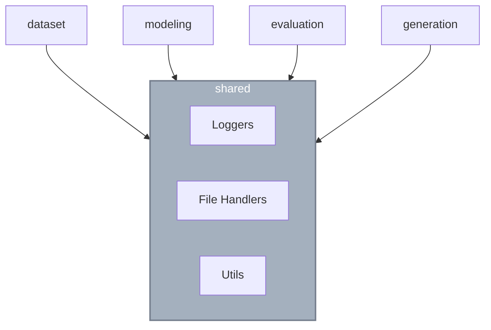

← [Back to Overview](README.md)

# 🛠 Shared Module

**Bounded Context**: Cross-Cutting Utilities

The `shared` module is not a strict bounded context in the DDD sense. It acts as a foundational utility layer that provides horizontal capabilities to all vertically sliced modules. It does not contain domain logic, entities, or use cases.

## 📦 Component Inventory

| Category | Component | Description |
|----------|-----------|-------------|
| **Config** | `config.py` | Exposes global configurations, specifically `ROOT_PATH` (project root directory) derived via `pathlib`. |
| **Types** | `types.py` | Common type aliases used across the system. |
| **Errors** | `errors.py` | Base exception classes (e.g., `DomainError`, `InfrastructureError`). |
| **Math** | `ndarray_utils.py` | Helper functions for Numpy array manipulations (e.g., `ensure_2d`). |
| **Reasons** | `reasons.py` | Standardized failure reason strings (`FeasibilityFailureReason`). |
| **ACL** | `ParetoGenerationACL` | Anti-Corruption Layer for interfacing with specific generation parameters safely. |
| **Logging** | `BaseLogger` | Interface for system-wide logging. |
| **Logging** | `CMDLogger` | CLI-friendly standard output logger. |
| **Logging** | `WandbLogger` | Weights & Biases telemetry logger for tracking ML experiments. |
| **I/O** | `JsonFileHandler` | Standard JSON reader/writer. |
| **I/O** | `TomlFileHandler` | TOML metadata persistence. |
| **I/O** | `NpzFileHandler` | Numpy compressed array storage. |
| **I/O** | `PickleFileHandler` | Native Python object serialization. |
| **I/O** | `SafeTensorsFileHandler` | Hugging Face safe deep learning weight serialization. |

## 📐 Consumption Pattern

Modules import from `shared` purely for implementation details (logging, persistence, typing). The dependency is one-way: `shared` never imports from `dataset`, `modeling`, `evaluation`, or `generation`.

---
Related: [Integration Rules](integration.md)
