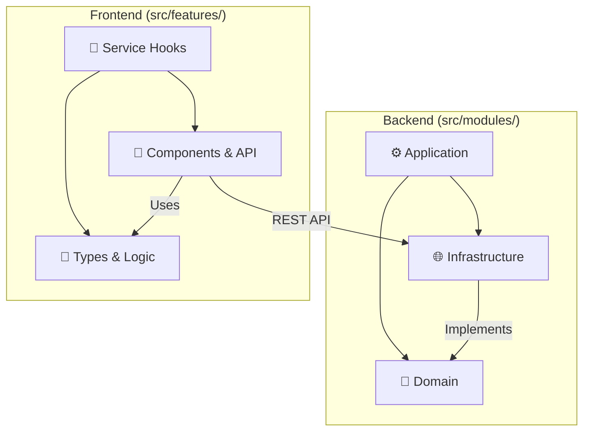

# 🧭 Domain-Driven Design & Clean Architecture Guide

This guide details our application of **Domain-Driven Design (DDD)** and **Clean Architecture**. Our goal is to isolate the mathematical "Inverse Design" theory from the technical implementation details (FastAPI, React, PyTorch).

---

## 🏛️ The Layered Vision

We follow a strict unidirectional dependency rule: **Inner layers never know about outer layers.**

| Layer | Responsibility | Backend Example | Frontend Example |
| :--- | :--- | :--- | :--- |
| **Domain** | Core "Math" & Business Rules | `InverseValidator`, `ParetoFront` | `InverseTypes`, `ValidationLogic` |
| **Application** | Orchestration & Use Cases | `TrainModelHandler` | `useGenerateCandidates` hook |
| **Infrastructure** | Concrete Implementations | `MDNAdapter`, `NPZRepository` | `ApiClient`, `PlotlyChart` |

---

## 🧠 1. Domain Layer: "The Heart"

> **"Code should scream the domain."** — Eric Evans

The domain layer is the most stable part of the system. It contains the logic that remains true regardless of whether we use a CLI, a Web API, or a mobile app.

### Key Components
- **Entities & Value Objects**: `Point`, `Bounds`, `ModelArtifact`.
- **Domain Services**: Logic that doesn't naturally fit in an entity (e.g., `FeasibilityChecker`).
- **Ports (Interfaces)**: Definitions like `BaseEstimator` that Infrastructure must implement.

---

## ⚙️ 2. Application Layer: "The Orchestrator"

The glue of the system. It receives commands (from CLI or API) and coordinates domain entities and infrastructure services to satisfy a use case.

### Key Components
- **Use Cases**: `train_inverse_model`, `generate_candidates`.
- **Factories**: Dynamically creating estimators or algorithms based on configuration.

---

## 🧩 3. Infrastructure Layer: "The Implementation"

This layer contains the "dirty" details: database access, file I/O, and external ML libraries.

### Key Components
- **Adapters**: Implementations of Domain interfaces (e.g., `PytorchINNAdapter`).
- **Repositories**: Handling persistence (`FileSystemDatasetRepository`).
- **UI & API**: The entry points to the system.

---

## 🧱 Cross-Stack Mapping

---

## ✅ Dependency Rule Summary

1.  🟢 **Domain** is the center. It imports **NOTHING** from other layers.
2.  🟡 **Application** imports from **Domain** and **Infrastructure (Interfaces)**.
3.  🔴 **Infrastructure** imports from **Domain** (to implement interfaces) and **Application** (to trigger use cases).

---

## 🚀 Research-to-Production Path

One of the project's key strengths is its ability to handle different levels of stability:

1.  **Notebooks (`/notebooks`)**: Used for "scratchpad" research, initial data exploration, and messy prototyping.
2.  **Infrastructure Overrides**: Once a prototype works, it's moved into an Infrastructure adapter.
3.  **Core Domain**: Only the most stable, mathematically verified logic resides in the Domain layer.

---

## 🏗️ Core Capabilities

- **Hybrid Modeling**: Supports deterministic regressors, probabilistic generative models (MDN, CVAE), and the custom **GPBI** algorithm.
- **Dockerized Foundation**: Guaranteed consistency between local development and containerized deployment.
- **Verification-First**: Built-in mechanisms to forward-check proposed designs against ground truth simulations.

---

## 💡 Rationale: Why this complexity?
1.  **Testability**: We can test the complex math of `InverseValidator` without needing a GPU or a Database.
2.  **Flexibility**: Swapping PyTorch for another framework only requires changing an **Infrastructure** adapter.
3.  **Clarity**: New developers can see exactly where the core logic lives versus the technical plumbing.
