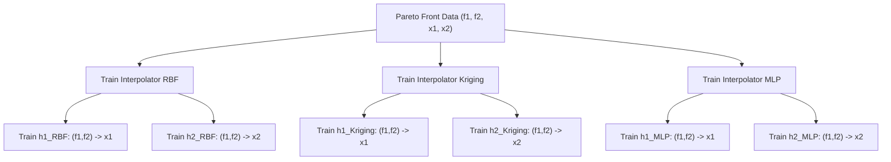
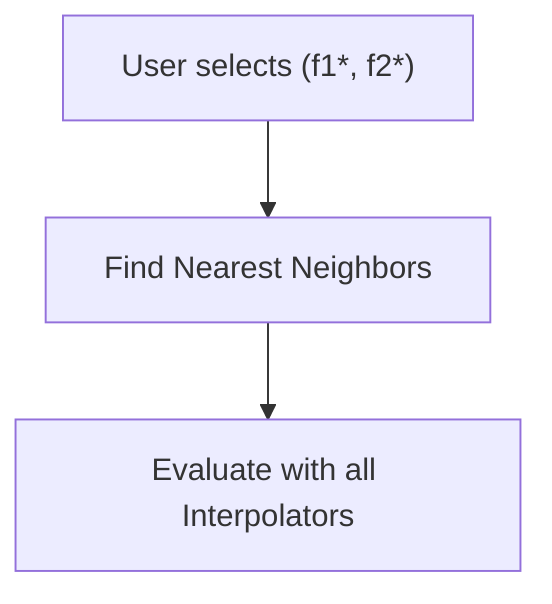
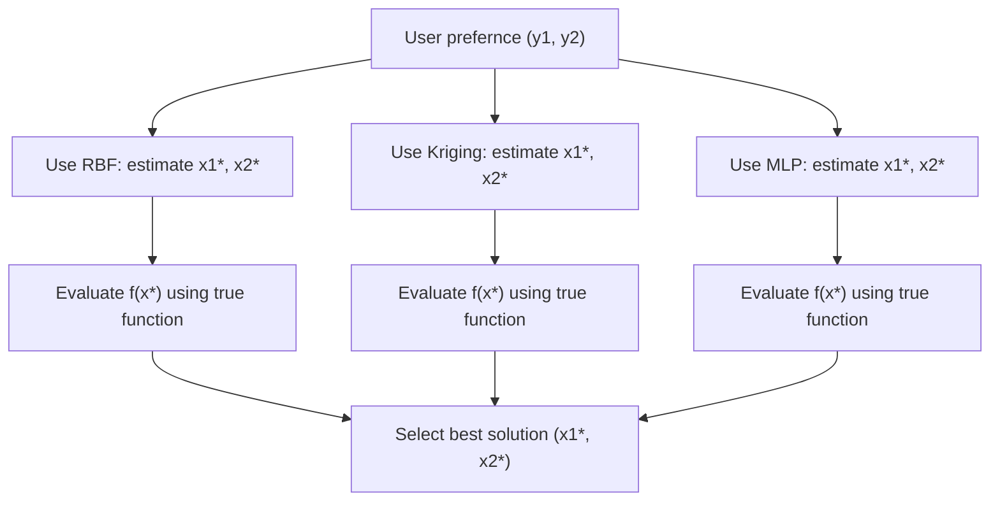

# Multi-Objective Optimization: Local Interpolation for Inverse Mapping

## 🧠 Overall Goal

Given:

- Pareto-optimal objective vectors:  
  $$Y = \{ y_i = (f_1^{(i)}, f_2^{(i)}) \in \mathbb{R}^2 \}_{i=1}^N$$
- Corresponding decision vectors:  
  $$X = \{ x_i \in \mathbb{R}^n \}_{i=1}^N$$
- User-provided target: $$y_{\text{target}} = (f_1^{\text{target}}, f_2^{\text{target}})$$

Estimate:  
$$x_{\text{target}} \approx \text{interpolated inverse of } y_{\text{target}}$$

## 📈 Step-by-Step Process

### 1. User Selection and Validation

- User selects arbitrary $$y_{\text{target}} = (f_1, f_2)$$
- **Validation condition**:  
  $$\min_i \| y_i - y_{\text{target}} \|_2 < \varepsilon$$
- If not satisfied: Issue warning/fallback

### 2. Neighbor Selection in Y-Space

- Find top $k$ nearest neighbors using Euclidean distance:  
  $$\mathcal{N} = \{ i \mid \text{sorted by } \| y_i - y_{\text{target}} \|_2, \text{ top } k \}$$
- Get neighboring sets:  
  $$Y_{\mathcal{N}} = \{ y_i \}_{i \in \mathcal{N}}, \quad X_{\mathcal{N}} = \{ x_i \}_{i \in \mathcal{N}}$$

### 3. Fit Local Interpolators

- Construct vector-valued interpolators:  
  $$\hat{x} = I_j(y) \in \mathbb{R}^n, \quad j = 1,2,\dots,m$$
- Common interpolators: RBF, Kriging, MLP
- Per-dimension approximation:  
  $$\hat{x}_d = I_j^{(d)}(f_1, f_2),  d = 1,\dots,n$$

### 4. Interpolation Step

- Generate candidate solutions:  
  $$\hat{x}_{\text{target}}^{(j)} = I_j(f_1^{\text{target}}, f_2^{\text{target}})$$
- Output: $$\{ \hat{x}_{\text{target}}^{(1)}, \dots, \hat{x}_{\text{target}}^{(m)} \}$$
- **Handling options**:
  - Return all candidates
  - Average solutions
  - Uncertainty-based ranking
  - Validation (next step)

### 5. Optional Refinement (Inverse Evaluation)

- If true objective function $$f(x)$$ is available:
  - Compute: $$f(\hat{x}_{\text{target}}^{(j)}) = (f_1^{(j)}, f_2^{(j)})$$
  - Select best $j^*$:  
    $$j^* = \arg\min_j \| f(\hat{x}_{\text{target}}^{(j)}) - y_{\text{target}} \|$$

## 📊 Process Flowchart

