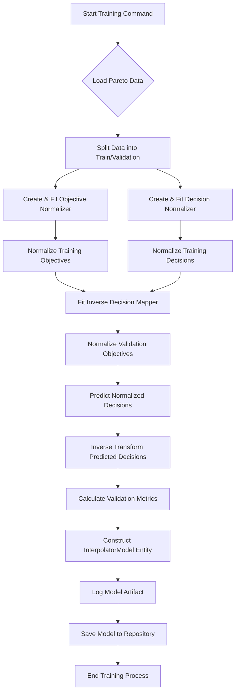

# Multi-Objective Optimization: Inverse Decision Mapping

## 🧠 Overall Goal

Given:

* A dataset of **Pareto-optimal objective vectors** $Y = \{ y_i = (f_1^{(i)}, \dots, f_m^{(i)}) \in \mathbb{R}^m \}_{i=1}^N$
* Their **corresponding decision vectors** $X = \{ x_i \in \mathbb{R}^n \}_{i=1}^N$
* A **user-provided target objective** $y_{\text{target}} = (f_1^{\text{target}}, \dots, f_m^{\text{target}})$

We aim to find the decision vector ($x_{\text{target}}$) that produces a desired objective vector ($y_{\text{target}}$). This is done by training a model to map objectives back to decisions.

$$x_{\text{target}} \approx I(y_{\text{target}})$$

## 📈 Step-by-Step Process

The process involves two main stages: **Training the Inverse Decision Mapper** and **Generating Decisions (Inference)**.

### Phase 1: Training the Inverse Decision Mapper

This phase prepares your Pareto-optimal data and trains a model to predict decision variables from objective values.

1. **Load Pareto Data:**
    * The system loads your complete set of Pareto-optimal objective ($Y$) and decision ($X$) data.

2. **Data Splitting:**
    * Data is divided into training and validation sets to assess the model's performance on unseen data.
    $$(Y_{\text{train}}, X_{\text{train}}), (Y_{\text{val}}, X_{\text{val}}) = \text{train\_test\_split}(Y, X)$$

3. **Data Normalization:**
    * Normalizers (e.g., `MinMaxScaler`) are created for both objectives ($Y$) and decisions ($X$).
    * They are trained on the data to transform it into a consistent scale (e.g., $[0, 1]$).
    $$Y_{\text{train}}^{\text{norm}} = \text{Norm}_Y(Y_{\text{train}}), \quad X_{\text{train}}^{\text{norm}} = \text{Norm}_X(X_{\text{train}})$$

    $$Y_{\text{val}}^{\text{norm}} = \text{Norm}_Y(Y_{\text{val}}), \quad X_{\text{val}}^{\text{norm}} = \text{Norm}_X(X_{\text{val}})$$

4. **Inverse Decision Mapper Training:**
    * An `InverseDecisionMapper` model (like RBF or MLP) is chosen. This model learns to map normalized objectives to normalized decisions.
    * The model is trained using the normalized training data:

        ```pseudocode
        TRAIN inverse_mapper WITH normalized_objectives_train AND normalized_decisions_train
        ```

5. **Validation & Metric Calculation:**
    * The trained model predicts decisions for the normalized validation objectives.

        ```pseudocode
        PREDICT normalized_decisions_pred_val = inverse_mapper ON normalized_objectives_val
        ```

    * These predictions are then converted back to their original scale:
        $$X_{\text{pred\_val}} = \text{Norm}_X^{-1}(X_{\text{pred\_val}}^{\text{norm}})$$
    * A chosen metric (e.g., Mean Squared Error) evaluates how well the predictions ($X_{\text{pred\_val}}$) match the actual validation decisions ($X_{\text{val}}$).

6. **Model Logging & Persistence:**
    * The complete trained model, including normalizers and performance metrics, is saved for future use.

## 📊 Process Flowcharts

### Flowchart 1: Inverse Decision Mapper Training Process


