# 🎯 Multi-Objective Optimization: Inverse Decision Mapping

## 🎯 Objective

Train a model to **learn the inverse mapping**:

> From: objective values (on the Pareto front)  
> To: decision variables that generated them

Formally:

$$
I: \mathbf{y} \in \mathbb{R}^m \longmapsto \mathbf{x} \in \mathbb{R}^n
$$

Where:

- $\mathbf{y}$ = objective vector
  $$
  Y = \{ \mathbf{y}_i = (f_1^{(i)}, f_2^{(i)}, \dots, f_m^{(i)}) \}_{i=1}^N
  $$

- $\mathbf{x}$ = decision vector
  $$
  X = \{ \mathbf{x}_i \in \mathbb{R}^n \}_{i=1}^N
  $$

We aim to compute a **decision vector** $\mathbf{x}_{\text{target}}$ that would generate an objective close to the target:

$$
\mathbf{x}_{\text{target}} \approx I(\mathbf{y}_{\text{target}})
$$

Where $I(\cdot)$ is an **inverse decision mapper**, trained on historical Pareto-optimal data

## 🔁 Process Overview

We build a model to learn how to map from objective values to decision values.

### Steps

1. **Load Historical Pareto Data**
   - Objective values $Y$ and decision values $X$

2. **Train/Validation Split**
   - Split into two subsets to assess generalization.

3. **Normalize the Data**
   - Scale both objectives and decisions to $[0, 1]$ using min-max normalization:
     $$
     \text{norm}(z) = \frac{z - \min(z)}{\max(z) - \min(z)}
     $$

4. **Train the Mapper**
   - Fit a model such as **RBF**, **Kriging**, or **MLP** to learn:
     $$
     I: \mathbb{R}^m \rightarrow \mathbb{R}^n, \quad \mathbf{y} \mapsto \mathbf{x}
     $$

5. **Validate and Measure Accuracy**
   - Predict decision values on unseen data
   - Compare predictions using a metric like Mean Squared Error (MSE)

6. **Save the Model**
   - Store the trained interpolator, normalizers, and performance metrics

## 📊 Flowchart: Training Phase

```mermaid
flowchart TD
  %% -----------------------------
  subgraph "PHASE 1 - 📂 Data Preparation"
    A["📂 Load Pareto Data (objectives, decisions)"]
    A -->| Split into train & val | B["✂️ Train/Validation Split"]
    B -->| Fit scaler on objectives | C["⚖️ Fit Objective Normalizer"]
    B -->| Fit scaler on decisions | D["⚖️ Fit Decision Normalizer"]
    C -->| Transform objectives_train | E["📏 Normalize Training Objectives"]
    D -->| Transform decisions_train | F["📏 Normalize Training Decisions"]
  end
  %% -----------------------------
  subgraph "PHASE 2 - 🧠 Model Training"
    E -->| Normalized objectives | G["🧠 Train Inverse Mapper (RBF, MLP, etc.)"]
    F -->| Normalized decisions | G
  end
  %% -----------------------------
  subgraph "PHASE 3 - 🔍 Validation"
    subgraph "🔹 Input Transformation"
      G --> H["🔍 Normalize Validation Objectives (objectives_val → objectives_val_norm)"]
    end
    subgraph "🔹 Prediction"
      H --> I["🧠 Predict Normalized Decisions (decisions_pred_norm)"]
      I --> J["🔁 Inverse Transform to Original Scale (decisions_pred)"]
    end
    subgraph "🔹 Evaluation"
      J --> K1["📐 Compute MSE"]
      J --> K2["📐 Compute MAE"]
      J --> K3["📐 Compute R² Score"]
      K1 --> K["📊 Aggregate Validation Metrics"]
      K2 --> K
      K3 --> K
    end
  end
  %% -----------------------------
  subgraph "PHASE 4 - 💾 Save & Store"
    K --> L["📦 Package Interpolator Model (model + scalers + metrics)"]
    L --> M["💾 Save to Model Repository"]
    M --> N["✅ Training Complete"]
  end

```

