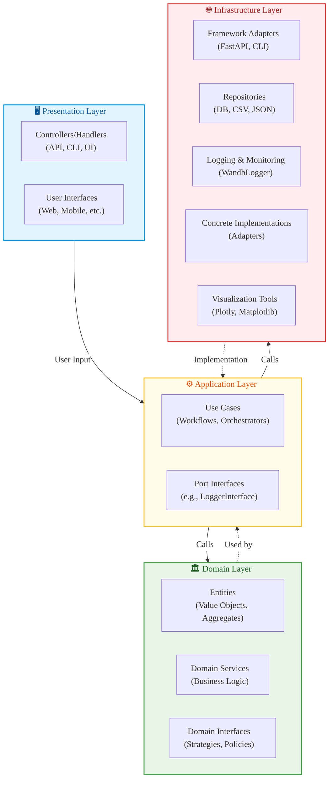

# 🧭 Domain-Driven Design Layering Guide

This guide helps you apply **Domain-Driven Design (DDD)** and **Clean Architecture** in real projects by clearly distinguishing **what goes where**. It ensures your system is **modular, maintainable, testable**, and **future-proof**.

---

## 📚 Overview of Architectural Layers

A well-structured system separates responsibilities across **three main layers**:

| Layer           | Responsibility                                   | Knows About              | Doesn't Know About         |
|------------------|--------------------------------------------------|---------------------------|-----------------------------|
| **Domain**       | Business logic, core rules, behaviors            | Itself                    | Web, DB, APIs, CLI          |
| **Application**  | Orchestration of domain logic for use cases     | Domain                    | UI, persistence details     |
| **Infrastructure**| External systems and frameworks integration     | Everything                | (Nothing, it's the lowest)  |

---

## 🧠 1. Domain Layer – “The Core”

> "The heart of the system. It knows the business, not the technology."

### ✅ What belongs here

- **Entities**: Domain objects with identity and lifecycle  
  _e.g., `User`, `OptimizationRun`, `Experiment`_
- **Value Objects**: Immutable, equality-based types  
  _e.g., `Coordinate`, `Range`, `Bounds`_
- **Domain Services**: Stateless logic that doesn’t belong to an entity  
  _e.g., `DistanceCalculator`, `Normalizer`, `Evaluator`_
- **Business Rules**: Core constraints, rules, and strategies  
  _e.g., how solutions are validated, or dominance is defined_
- **Base Classes & Interfaces for Domain Strategies**  
  _e.g., `BaseAlgorithm`, `BaseOptimizer`, `BaseProblem` — when these define domain **behaviors**, not I/O_

### ✅ Allowed Dependencies

- Pure Python, `numpy`, `scipy`, or math libs
- Modeling helpers like `sklearn.BaseEstimator` (only internal)
- No I/O, no file access, no frameworks

### ❓ Ask Yourself

- Does this code **express business rules** or **core logic**?
- Can I run this logic **without a web server, database, or external system**?
- Would a **domain expert** understand this without knowing Python?

---

## ⚙️ 2. Application Layer – “The Use Cases”

> "What the system does for the user. It coordinates domain logic."

### ✅ What belongs here

- **Use Case Classes**  
  _e.g., `RunOptimization`, `EvaluateSolution`, `TrainModel`_
- **Orchestrators / Coordinators**  
  _e.g., pulling an algorithm, fitting it, evaluating results, logging them_
- **Port Interfaces** (for external dependencies)  
  _e.g., `PlottingInterface`, `RepositoryInterface`, `LoggerInterface`_
- **Pipelines / Batch Jobs / CLI Commands**  
  _Tasks that call domain logic to do something real for the user_

### ❓ Ask Yourself

- Does this code **coordinate multiple components**?
- Is it **dependent on the domain**, but **independent of external frameworks**?
- Would this logic survive if we switched the database or UI?

---

## 🧩 3. Infrastructure Layer – “The Outside World”

> "Implements the technical details that change most often."

### ✅ What belongs here

- **Framework Adapters**  
  _e.g., FastAPI endpoints, Typer CLI commands_
- **Repositories / File Systems**  
  _e.g., JSONLoader, CSVWriter, SQLAlchemy models_
- **Plotters / Visualizations**  
  _e.g., Plotly, Matplotlib, Seaborn tools_
- **ML Framework Adapters**  
  _e.g., `SklearnModelAdapter`, `PytorchTrainer`_
- **Logging / Monitoring / Metrics**  
  _e.g., `WandbLogger`, `TensorBoardLogger`_

### ❓ Ask Yourself

- Does this code **talk to the outside world**?
- Is it based on a **framework, library, or tool**?
- Would this code need to change if I switched tool X to Y?

---

## 🧪 Practical Examples

| Module/Component             | Belongs In      | Reason |
|-----------------------------|------------------|--------|
| `ParetoFrontCalculator`     | Domain           | Pure logic, no I/O |
| `BaseOptimizer`             | Domain           | Encodes strategy, not I/O |
| `TrainModelUseCase`         | Application      | Orchestrates model training |
| `WandbLogger`               | Infrastructure   | External logging tool |
| `PlotlyParetoPlotter`       | Infrastructure   | Depends on external lib (Plotly) |
| `FastAPIController`         | Infrastructure   | Web adapter |
| `CLI entrypoint (Typer)`    | Infrastructure   | User interface adapter |
| `DataRepositoryInterface`   | Application      | Defines boundary, implemented in Infra |
| `JSONExperimentLoader`      | Infrastructure   | I/O-specific implementation |
| `HypercubeNormalizer`       | Domain           | Math logic, reusable across problems |

---

## ✅ Rule of Thumb

> 🟢 **If it expresses business logic or rules, it's Domain**  
> 🟡 **If it coordinates components and actions, it's Application**  
> 🔴 **If it touches frameworks or the outside world, it's Infrastructure**

---

## 🧠 Bonus Heuristics

Ask these questions when in doubt:

| Question | Likely Layer |
|----------|--------------|
| "Would a business analyst care about this logic?" | Domain |
| "Would this break if I changed my database or CLI tool?" | Infrastructure |
| "Does this pull logic together from multiple parts?" | Application |
| "Does this need internet, disk, or external service?" | Infrastructure |
| "Can I unit test this without mocking external systems?" | Domain or Application |

---

## 🧱 Directory Example (Recommended)

```plaintext
my_app/
├── domain/
│   ├── models/             # Entities, value objects (e.g., Solution, Coordinates)
│   ├── services/           # Pure logic (e.g., BaseAlgorithm, Optimizer, Problem, Evaluator)
│   └── interfaces/         # Abstract base classes (e.g., RepositoryInterface, LoggerInterface)
├── application/
│   ├── use_cases/          # Business workflows (e.g., RunOptimization, TrainModel)
│   ├── orchestrators/      # High-level coordinators or pipelines
│   └── cli/                # CLI commands (Typer command definitions)
├── infrastructure/
│   ├── visualizers/           # Framework-specific visualizers (e.g., PlotlyParetoPlotter)
│   ├── repositories/       # File/DB adapters (e.g., JSONLoader, CSVWriter)
│   └── loggers/            # External logger implementations (e.g., WandbLogger)
├── main.py                 # Entrypoint (e.g., CLI launcher or server start)
└── pyproject.toml          # Project config and dependencies
sql
Copy
Edit
```

## 🗺 Mermaid Architecture Diagram



## 💡 Final Thought

> **"Code should scream the domain." — Eric Evans**  
Structure your code so its intent and logic are obvious. Don’t let technology dictate design — let the problem domain lead.
