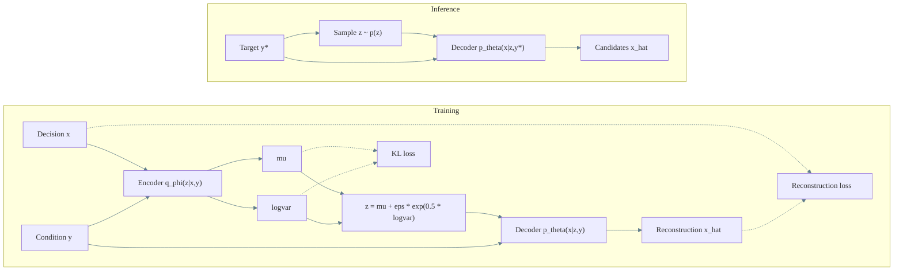

# Conditional VAE (CVAE) Estimator

## Purpose

Model the inverse mapping as a conditional distribution p(x|y). A CVAE captures one-to-many relationships by sampling multiple plausible decisions x given a target objective y.

## Inputs and outputs

- Condition: objective vector y
- Target: decision vector x
- Latent: z (captures multi-modality)

## Training objective (ELBO)

The CVAE maximizes the evidence lower bound:

$$
L = E_{q_phi(z|x,y)}[log p_theta(x|z,y)] - beta * KL(q_phi(z|x,y) || p(z))
$$

## Inference

At query time, sample z from the prior p(z), then decode with the target y to generate candidate decisions x_hat.

## When to use

- Multi-modal inverse mappings where multiple decisions satisfy the same objective.
- Interactive exploration that benefits from diverse candidate proposals.
