# Autoencoder Formulation for Pareto Front Analysis

Some of considerd limitations:

1. Defining the optimal point (energy/time -> acceleration) at the beginning of the system. The user has the ability to select that.
2. All data features should be taken into account, e.g. (Decision variables + problem parameters + objectives)

Offline:

1. Train CVAE on Pareto profiles & conditions $c_i$.
2. For each training sample, compute anchor pairs:
   $ (c_i, μ_i) $ ← Encoder $(x_i,c_i)$.
3. Train conditional prior $f_ψ: c_i → μ_i$.

## Conditional VAE Architecture

### Why to use?

In traditional autoencoders, inputs are mapped deterministically to a latent vector
$z=e(x)$. In variational autoencoders, inputs are mapped to a probability distribution over latent vectors, and a latent vector is then sampled from that distribution. The decoder becomes more robust at decoding latent vectors as a result.

### Variational Autoencoder (VAE) Latent Space Mapping

                     Input Conditions
                      (SOC, Distance,
                      Velocity Profile)
                           │
                           ▼
                ┌───────────────────────┐
                │      Conditioner      │
                │  (MLP Transformer)    │
                └───────────────────────┘
                           │
                           ├──────────────────────┐
                           ▼                      ▼
                ┌───────────────────────┐ ┌───────────────────────┐
                │       Encoder         │ │      Decoder          │
                │  (q(z|x,c))           │ │  (p(x|z,c))           │
                └───────────────────────┘ └───────────────────────┘
                           │                      ▲
                           └───────► z ◄─────────┘
                                  Latent Space

Instead of directly mapping the input **$ x $** to a latent vector **$ z = e(x) $**, we instead map it to:

- **Mean vector**: **$ \mu(x) $**
- **Standard deviation vector**: **$ \sigma(x) $**

These parameters define a **diagonal Gaussian distribution** $ N(\mu(x), \sigma(x)) $, from which we sample the latent vector $ z $:

$$
z \sim N(\mu(x), \sigma(x))
$$

This formulation allows the model to learn a probabilistic latent space representation where each input $ x $ defines its own distribution over latent codes rather than a single deterministic point.

### 1. Problem Definition

Let:

- **x** ∈ ℝ² : Solution vector (time_min, energy_kwh)
- **c** ∈ ℝ⁵ : Condition vector (SOC, distance, avg_velocity, max_accel, energy_weight, time_weight)
- **z** ∈ ℝᴸ : Latent representation (L=8)

### 2. Probabilistic Model

**Objective**: Learn conditional distribution
$$p_\theta(x|z,c) \quad \text{where} \quad z \sim q_\phi(z|x,c)$$

**Evidence Lower Bound (ELBO)**:
$$
\mathcal{L}(\theta,\phi;x,c) = \mathbb{E}_{q_\phi(z|x,c)}[\log p_\theta(x|z,c)] - \beta D_{KL}(q_\phi(z|x,c) \| p(z))
$$

### Encoder Network (Compression)

$$
\mathbf{z} = g_\phi(\mathbf{x}) = \text{LeakyReLU}(\mathbf{W}_2 \cdot \text{ELU}(\mathbf{W}_1\mathbf{x} + \mathbf{b}_1) + \mathbf{b}_2)
$$

### Decoder Network (Reconstruction)

$$
\hat{\mathbf{x}} = f_\theta(\mathbf{z}) = \text{Sigmoid}(\mathbf{W}_4 \cdot \text{ELU}(\mathbf{W}_3\mathbf{z} + \mathbf{b}_3) + \mathbf{b}_4)
$$

**Dimensionality**:

- Input/Output: $\mathbb{R}^2$ (normalized objectives)
- Latent space: $\mathbb{R}^1$ (bottleneck)
- Hidden layers: 32 neurons with ELU activation

## Architecture

Sigmoid ensures outputs stay in normalized $[0,1]$ range

### Encoder

Maps 2D Pareto solutions to a 1D latent space:
$$
\mathbf{z} = \text{Encoder}(\mathbf{x}) = \sigma(\mathbf{W}_2 \cdot \text{ReLU}(\mathbf{W}_1\mathbf{x} + \mathbf{b}_1) + \mathbf{b}_2)
$$

Where:

- $\mathbf{W}_1 \in \mathbb{R}^{h \times 2}$, $\mathbf{W}_2 \in \mathbb{R}^{1 \times h}$ are weight matrices
- $\mathbf{b}_1 \in \mathbb{R}^h$, $\mathbf{b}_2 \in \mathbb{R}^1$ are bias terms
- $h$ is hidden layer size
- $\sigma$ is sigmoid activation

### Decoder

Reconstructs solutions from latent space:
$$
\hat{\mathbf{x}} = \text{Decoder}(\mathbf{z}) = \sigma(\mathbf{W}_4 \cdot \text{ReLU}(\mathbf{W}_3\mathbf{z} + \mathbf{b}_3) + \mathbf{b}_4)
$$

With:

- $\mathbf{W}_3 \in \mathbb{R}^{h \times 1}$, $\mathbf{W}_4 \in \mathbb{R}^{2 \times h}$
- $\mathbf{b}_3 \in \mathbb{R}^h$, $\mathbf{b}_4 \in \mathbb{R}^2$

### Activation function

### Loss Function

Mean Squared Error (MSE) reconstruction loss:
$$
\mathcal{L}_{recon} = \frac{1}{N}\sum_{i=1}^N \|\mathbf{x}_i - \hat{\mathbf{x}}_i\|^2_2
$$

## 1. Composite Loss Components

The total optimization objective combines three critical elements:

$$
\mathcal{L}_{total} = \mathcal{L}_{recon} + \beta\mathcal{L}_{KL} + \mathcal{L}_{phys}
$$

#### 1.1 Weighted Reconstruction Loss

Domain-prioritized MSE accounting for operational criticality:
$$
\mathcal{L}_{recon} = \frac{1}{N}\sum_{i=1}^N \left[w_t\left(\frac{\hat{t}_i - t_i}{t_{max}}\right)^2 + w_e\left(\frac{\hat{e}_i - e_i}{e_{max}}\right)^2\right]
$$

| Parameter | Value | Rationale |
|-----------|-------|-----------|
| $w_t$     | 0.7   | Time minimization priority |
| $w_e$     | 0.3   | Energy conservation importance |
| $t_{max}$ | 120 min | Maximum allowable trip time |
| $e_{max}$ | 10 kWh | Battery capacity limit |

#### 1.2 KL Divergence Regularization

Gaussian constraint for latent space organization:
$$
\mathcal{L}_{KL} = \frac{1}{2}\sum_{j=1}^8 \left[\exp(\log\sigma_j^2) + \mu_j^2 - 1 - \log\sigma_j^2\right]
$$

#### 1.3 Physics-Informed Penalty

Hard constraint enforcement through soft penalties:
$$
\mathcal{L}_{phys} = \lambda_1\max(0, \hat{e} - e_{max})^2 + \lambda_2\max(0, t_{min} - \hat{t})^2
$$

| Constraint | Formula | Weight $\lambda$ |
|------------|---------|-------|
| Energy Cap | $\hat{e} \leq 10\text{kWh}$ | 1.5 |
| Time Floor | $\hat{t} \geq \frac{d}{v_{max}}$ | 0.8 |

```mermaid
%%{init: {
  "theme": "default",
  "themeVariables": {
    "primaryColor": "#E3F2FD",
    "primaryBorderColor": "#0091EA",
    "primaryTextColor": "#1976D2",
    "secondaryColor": "#E8F5E9",
    "secondaryBorderColor": "#4CAF50",
    "secondaryTextColor": "#1B5E20",
    "tertiaryColor": "#FFFDE7",
    "tertiaryBorderColor": "#FFC107",
    "tertiaryTextColor": "#E65100",
    "lineColor": "#607D8B",
    "fontFamily": "Segoe UI, sans-serif",
    "fontSize": "16px",
    "nodeSpacing": 50,
    "rankSpacing": 100
  }
}}%%
graph TD
    classDef input fill:#E0E0E0,stroke:#616161,stroke-width:2px;
    classDef layer fill:#BBDEFB,stroke:#2196F3,stroke-width:2px;
    classDef process fill:#C8E6C9,stroke:#4CAF50,stroke-width:2px;
    classDef latent fill:#FFF9C4,stroke:#FFEB3B,stroke-width:2px;
    classDef output fill:#FCE4EC,stroke:#E91E63,stroke-width:2px;

    A("Input Data<br>(X)"):::input
    
    subgraph S1["<b>🧠 Encoder Network</b>"]
        direction LR
        B["Neural Network<br>(Maps X to Latent Space)"]:::layer
        B --> C1["Mean (μ)"]:::latent
        B --> C2["Log Variance (log σ²)"]:::latent
    end
    
    subgraph S2["<b>⚡ Reparameterization Trick</b>"]
        direction LR
        E("z = μ + ε * exp(0.5 * log σ²)"):::latent
        D("Sample from<br>Normal Dist. N(0,1)") --> E
    end
    
    subgraph S3["<b>🎨 Decoder Network</b>"]
        direction LR
        F["Neural Network<br>(Maps z back to Data Space)"]:::layer
        F --> G("Reconstructed Output<br>(X̂)"):::output
    end

    subgraph S4["<b>⚖️ Loss Function</b>"]
        direction LR
        H["KL Divergence Loss<br>(between Latent and Prior)"]:::process
        I["Reconstruction Loss<br>(e.g., MSE or BCE)"]:::process
        H --> J("Total Loss"):::process
        I --> J
    end
    
    A --> S1
    S1 --> S2
    S2 --> S3
    
    A -- Original Data --> I
    G -- Reconstructed Data --> I
    
    S1 -- Latent Distribution --> H
    
    J --> K["Backpropagation<br>(Update Weights)"]:::process
```

