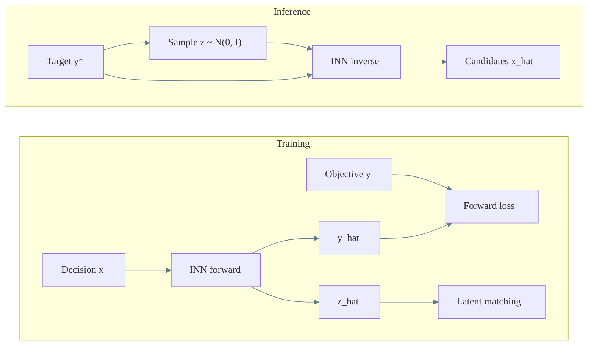

# Invertible Neural Network (INN) Estimator

## Purpose

An INN learns a bijection between decisions x and outputs (y, z). The latent z captures information lost in the forward mapping, allowing inversion from (y*, z) to x_hat.

## Training signals

- Forward consistency: f_inn(x) -> (y_hat, z_hat)
- Inverse consistency: f_inn^{-1}(y, z) -> x_hat
- Distribution matching on z to encourage a simple prior (e.g., standard normal)

## When to use

- You want exact invertibility in the architecture.
- You need fast inverse sampling conditioned on a target objective.
