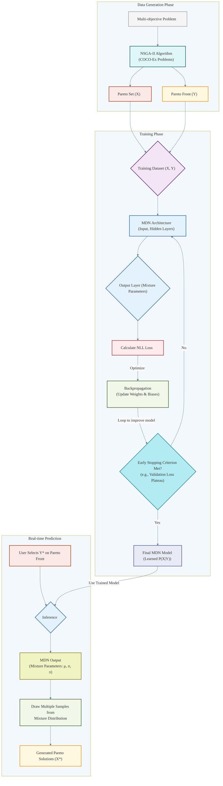

```mermaid
%%{init: {
  "theme": "default",
  "themeVariables": {
    "fontFamily": "Inter, Arial, sans-serif",
    "fontSize": "18px",
    "primaryColor": "#E7F6FF",
    "primaryBorderColor": "#0091EA",
    "primaryTextColor": "#1976D2",
    "nodeBorder": "#80D8FF",
    "edgeLabelBackground": "#FCFCFC",
    "clusterBkg": "#F3F8FC",
    "lineColor": "#607D8B"
  },
  "flowchart": {
    "curve": "basis",
    "padding": 20,
    "nodeSpacing": 50,
    "rankSpacing": 90
  }
}}%%

flowchart TD
    subgraph "Data Generation Phase"
        multiObjectiveProblem["Multi-objective Problem"] --> nsgaII["NSGA-II Algorithm<br>(COCO-Ex Problems)"];
        nsgaII --> paretoSetX["Pareto Set (X)"];
        nsgaII --> paretoFrontY["Pareto Front (Y)"];
    end

    subgraph "Training Phase"
        paretoSetX & paretoFrontY --> trainingDataset{"Training Dataset (X, Y)"};
        trainingDataset --> mdnArchitecture["MDN Architecture<br>(Input, Hidden Layers)"];
        mdnArchitecture --> outputLayer{"Output Layer (Mixture Parameters)"};
        outputLayer --> calculateNLL["Calculate NLL Loss"];
        calculateNLL -- "Optimize" --> backprop["Backpropagation<br>(Update Weights & Biases)"];
        backprop -- "Loop to improve model" --> stoppingCriterion{"Early Stopping Criterion Met?<br>(e.g., Validation Loss Plateau)"};
        stoppingCriterion -- "No" --> mdnArchitecture;
        stoppingCriterion -- "Yes" --> finalModel["Final MDN Model<br>(Learned P(X|Y))"];
    end

    subgraph "Real-time Prediction"
        userInput["User Selects Y* on Pareto Front"] --> inference{Inference};
        finalModel -- "Use Trained Model" --> inference;
        inference --> mdnOutput["MDN Output<br>(Mixture Parameters: μ, σ, π)"];
        mdnOutput --> drawSamples["Draw Multiple Samples from<br>Mixture Distribution"];
        drawSamples --> generatedSolutions["Generated Pareto Solutions (X*)"];
    end
    
    style multiObjectiveProblem fill:#F5F5F5,stroke:#9E9E9E,stroke-width:2px;
    style nsgaII fill:#E0F7FA,stroke:#006064,stroke-width:2px;
    style paretoSetX fill:#FBE9E7,stroke:#BF360C,stroke-width:2px;
    style paretoFrontY fill:#FFF8E1,stroke:#FF8F00,stroke-width:2px;
    style trainingDataset fill:#F3E5F5,stroke:#4A148C,stroke-width:2px;
    style mdnArchitecture fill:#E3F2FD,stroke:#1565C0,stroke-width:2px;
    style outputLayer fill:#E3F2FD,stroke:#1565C0,stroke-width:2px;
    style calculateNLL fill:#FFEBEE,stroke:#C62828,stroke-width:2px;
    style backprop fill:#F1F8E9,stroke:#33691E,stroke-width:2px;
    style stoppingCriterion fill:#B2EBF2,stroke:#00838F,stroke-width:2px;
    style finalModel fill:#E8EAF6,stroke:#3F51B5,stroke-width:2px;
    style userInput fill:#FBE9E7,stroke:#BF360C,stroke-width:2px;
    style inference fill:#E3F2FD,stroke:#1565C0,stroke-width:2px;
    style mdnOutput fill:#F0F4C3,stroke:#827717,stroke-width:2px;
    style drawSamples fill:#F1F8E9,stroke:#33691E,stroke-width:2px;
    style generatedSolutions fill:#FFF8E1,stroke:#FF8F00,stroke-width:2px;

```
