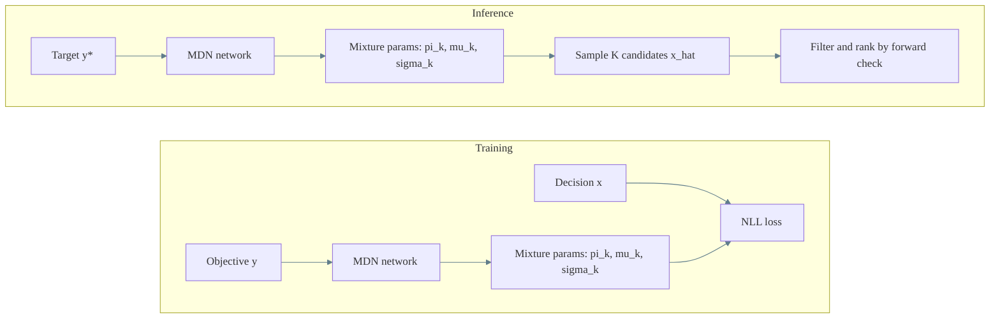

# Mixture Density Network (MDN) Estimator

## Purpose

An MDN models p(x|y) as a mixture of Gaussians. It outputs mixture weights, means, and variances, which enables sampling multiple candidate decisions for a single target objective.

## Training objective

Given pairs (x, y), the MDN learns mixture parameters and minimizes the negative log-likelihood:

$$
L = -log\left(\sum_{k=1}^K pi_k(y) * N(x | mu_k(y), sigma_k(y))\right)
$$

## Inference

Given a target y*, the MDN produces mixture parameters and samples K candidate decisions x_hat.

## When to use

- Inverse mapping is multi-valued and you want diverse candidates.
- You want a compact probabilistic output without a latent variable model.
