# Variational Autoencoders (VAE) → then Conditional VAEs (CVAE)

This note first covers **VAE**, then extends the ideas to **CVAE**. It explains
**what each stage takes in and produces**, **why the encoder posterior is modeled
as a Gaussian**, and **why a PriorNet is useful** in the conditional setting.

---

## 1) Variational Autoencoder (VAE)

### Notation

- $x \in \mathbb{R}^{D_x}$: observed data  
- $z \in \mathbb{R}^{L}$: latent code  
- Prior: $p(z)=\mathcal{N}(0,I)$  
- Encoder (approx. posterior):
  $$
  q_\phi(z \mid x) \;=\; \mathcal{N}\!\big(\mu_\phi(x),\, \mathrm{diag}(\sigma_\phi^2(x))\big)
  $$
- Decoder (likelihood), common choices:
  - **Gaussian**: $p_\theta(x \mid z)=\mathcal{N}\!\big(\mu_\theta(z),\, \mathrm{diag}(\sigma_\theta^2(z))\big)$
  - **Bernoulli**: $p_\theta(x \mid z)=\mathrm{Bernoulli}(\eta_\theta(z))$

> Inline example: $(\mu_\phi(x), \log \sigma_\phi^2(x)) \leftarrow \text{Encoder}(x)$.

### Stages (I/O at a glance)

| Stage | Input | Network | Output (meaning) |
|---|---|---|---|
| Encoder $q_\phi(z\mid x)$ | $x$ | neural net | $\mu_\phi(x), \log\sigma_\phi^2(x)$ — params of a diagonal Gaussian for $z$ |
| Reparam | $\mu_\phi, \sigma_\phi$ | — | $z=\mu_\phi(x)+\sigma_\phi(x)\odot\varepsilon,\ \varepsilon\sim\mathcal N(0,I)$ |
| Decoder $p_\theta(x\mid z)$ | $z$ | neural net | likelihood params of $x$ (e.g., $\mu_\theta, \log\sigma_\theta^2$ or Bernoulli logits) |

### Reconstruction log-likelihood (Gaussian head)

$$
\log p_\theta(x \mid z)
= -\tfrac12 \sum_{d=1}^{D_x}
\left[
\log\!\big(2\pi\,\sigma_{\theta,d}^2(z)\big)
+ \frac{\big(x_d - \mu_{\theta,d}(z)\big)^2}{\sigma_{\theta,d}^2(z)}
\right].
$$

### KL to prior (closed-form for diagonal Gaussians)

$$
\mathrm{KL}\!\big(q_\phi(z \mid x)\,\|\,\mathcal{N}(0,I)\big)
= \tfrac12 \sum_{j=1}^{L}\Big(\sigma_{\phi,j}^2(x) + \mu_{\phi,j}^2(x) - 1 - \log \sigma_{\phi,j}^2(x)\Big).
$$

### ELBO / Loss

$$
\mathcal{L}_{\text{ELBO}}(x;\theta,\phi)
= \mathbb{E}_{q_\phi(z \mid x)}\big[\log p_\theta(x \mid z)\big]
- \mathrm{KL}\!\big(q_\phi(z \mid x)\,\|\,p(z)\big).
$$

### Why model $q_\phi(z\mid x)$ as a Gaussian?

- **Tractable KL** to a simple prior.  
- **Reparameterization trick**: $z=\mu+\sigma\odot\varepsilon$ yields low-variance gradients.  
- **Good default**: even if the true posterior is not Gaussian, this is a robust,
  fast approximation. (You can later upgrade to flows/mixtures if needed.)

### Inference (after training)

- **Generate new $x$**: sample $z \sim p(z)$, then $x \sim p_\theta(x \mid z)$.  
- **Reconstruct a given $x$**: use $z=\mu_\phi(x)$ or sample $z \sim q_\phi(z \mid x)$, then decode.  
- **Expected reconstruction (mean)**:
  - Gaussian decoder: $\mathbb{E}[x \mid z] = \mu_\theta(z)$.
  - Mixture decoder: $\mathbb{E}[x \mid z] = \sum_{k} \pi_k(z)\,\mu_k(z)$.
  
### VAE Diagram

```mermaid
%%{init: {
  "theme": "default",
  "themeVariables": {
    "primaryColor": "#E3F2FD",
    "primaryBorderColor": "#0091EA",
    "primaryTextColor": "#1976D2",
    "secondaryColor": "#E8F5E9",
    "secondaryBorderColor": "#4CAF50",
    "secondaryTextColor": "#1B5E20",
    "tertiaryColor": "#FFFDE7",
    "tertiaryBorderColor": "#FFC107",
    "tertiaryTextColor": "#E65100",
    "lineColor": "#607D8B",
    "fontFamily": "Segoe UI, sans-serif",
    "fontSize": "16px",
    "nodeSpacing": 50,
    "rankSpacing": 100
  }
}}%%
graph TD
    classDef input fill:#E0E0E0,stroke:#616161,stroke-width:2px;
    classDef layer fill:#BBDEFB,stroke:#2196F3,stroke-width:2px;
    classDef process fill:#C8E6C9,stroke:#4CAF50,stroke-width:2px;
    classDef latent fill:#FFF9C4,stroke:#FFEB3B,stroke-width:2px;
    classDef output fill:#FCE4EC,stroke:#E91E63,stroke-width:2px;
    classDef prior fill:#FFE0B2,stroke:#FB8C00,stroke-width:2px;

    A("Input Data<br/>(x)"):::input

    subgraph S1["<b>🧠 Encoder</b> &nbsp; $q_\phi(z|x)$"]
      direction LR
      B["NN maps x → latent params"]:::layer
      B --> C1["Mean μ<sub>φ</sub>(x)"]:::latent
      B --> C2["Log-Var log σ²<sub>φ</sub>(x)"]:::latent
    end

    subgraph S2["<b>⚡ Reparameterization</b>"]
      direction LR
      D("ε ~ N(0, I)"):::latent --> E("z = μ + σ ⊙ ε"):::latent
    end

    subgraph S3["<b>🎨 Decoder</b> &nbsp; $p_θ(x|z)$"]
      direction LR
      F["NN maps z → likelihood params"]:::layer
      F --> G("Reconstruction x̂"):::output
    end

    subgraph S4["<b>⚖️ Loss</b> (ELBO)"]
      direction LR
      H["KL: KL(q<sub>φ</sub>(z|x) || p(z))"]:::process
      I["Reconstruction: -log p<sub>θ</sub>(x|z)"]:::process
      H --> J("Total Loss"):::process
      I --> J
    end

    P("Prior p(z)=N(0,I)"):::prior --> H

    A --> S1
    S1 --> S2
    S2 --> S3

    A -- original x --> I
    G -- reconstructed x̂ --> I

    S1 -- q<sub>φ</sub>(z|x) --> H
    J --> K["Backprop (update θ, φ)"]:::process
```

---

## Training Pipeline (VAE)

**Stage 1 — Encoder**  
Input/Output: $x \;\to\; \big(\mu_\phi(x),\, \log\sigma_\phi^2(x)\big)$  
Definition:
$$
q_\phi(z \mid x)=\mathcal{N}\!\big(\mu_\phi(x),\ \mathrm{diag}(\sigma_\phi^2(x))\big)
$$

**Stage 2 — Reparameterization**  
Input/Output: $\big(\mu_\phi(x),\sigma_\phi(x)\big) \;\to\; z$  
Equation:
$$
\varepsilon \sim \mathcal{N}(0,I),\qquad
z=\mu_\phi(x) + \sigma_\phi(x)\odot \varepsilon
$$

**Stage 3 — Decoder**  
Input/Output: $z \;\to\;$ likelihood parameters of $x$  
Examples:
$$
p_\theta(x \mid z)=\mathcal{N}\!\big(\mu_\theta(z),\ \mathrm{diag}(\sigma_\theta^2(z))\big)
\quad\text{or}\quad
p_\theta(x \mid z)=\mathrm{Bernoulli}(\eta_\theta(z))
$$

**Stage 4 — Reconstruction log-likelihood**  
Compute $\log p_\theta(x \mid z)$ (closed form depends on head).  
Gaussian example (diagonal covariance):
$$
\log p_\theta(x \mid z)
= -\tfrac12 \sum_{d=1}^{D_x}
\left[
\log\!\big(2\pi\,\sigma_{\theta,d}^2(z)\big)
+ \frac{\big(x_d - \mu_{\theta,d}(z)\big)^2}{\sigma_{\theta,d}^2(z)}
\right]
$$

**Stage 5 — KL divergence to prior**  
Closed-form for diagonal Gaussians:
$$
\mathrm{KL}\!\big(q_\phi(z \mid x)\,\|\,\mathcal{N}(0,I)\big)
= \tfrac12 \sum_{j=1}^{L}\Big(\sigma_{\phi,j}^2(x) + \mu_{\phi,j}^2(x) - 1 - \log \sigma_{\phi,j}^2(x)\Big)
$$

**Stage 6 — ELBO / Loss**  
Maximize ELBO (or minimize its negative):
$$
\mathcal{L}_{\text{ELBO}}(x;\theta,\phi)
= \mathbb{E}_{q_\phi(z \mid x)}\big[\log p_\theta(x \mid z)\big]
- \mathrm{KL}\!\big(q_\phi(z \mid x)\,\|\,p(z)\big)
$$

---

## Inference (after training)

- **Generate new $x$**: sample $z \sim p(z)$, then $x \sim p_\theta(x \mid z)$.
- **Reconstruct a given $x$**: use $z=\mu_\phi(x)$ (deterministic) or sample $z \sim q_\phi(z \mid x)$, then decode.
- **Expected reconstruction (mean)**:
  - Gaussian decoder: $\mathbb{E}[x \mid z] = \mu_\theta(z)$.
  - Mixture decoder: $\mathbb{E}[x \mid z] = \sum_{k} \pi_k(z)\,\mu_k(z)$.

---

## 2) Conditional VAE (CVAE)

Now **condition everything on $y$** (e.g., you want to model decisions $x$ given objectives $y$).

- **Conditional prior (PriorNet)**: $p_\theta(z \mid y)$  
- **Encoder (posterior)**: $q_\phi(z \mid x,y)$  
- **Decoder (likelihood)**: $p_\theta(x \mid z,y)$

### Big picture (generative vs. inference)

- **Generative path** (how the model says data are made):  
  $y \to z \sim p_\theta(z\mid y) \to x \sim p_\theta(x\mid z,y)$.

- **Inference path** (how we infer latents from data):  
  $q_\phi(z\mid x,y) \approx p_\theta(z\mid x,y)$.

---

## Q&A (Core Concepts)

### Q1) Why is the encoder posterior $q_\phi(z\mid x,y)$ Gaussian?

Because we want a **simple, reparameterizable** family with a **closed-form KL** to the (conditional) prior:

- **Reparameterization**: $z=\mu_\phi(x,y)+\sigma_\phi(x,y)\odot\varepsilon$ with $\varepsilon\sim\mathcal N(0,I)$ gives low-variance gradients.
- **Closed-form KL** against a Gaussian conditional prior $p_\theta(z\mid y)$ makes training stable and efficient:
  $$
  \mathrm{KL}\!\big(q_\phi(z\mid x,y)\,\|\,p_\theta(z\mid y)\big)\ \text{has a closed form for diagonal Gaussians.}
  $$
- It’s a **practical approximation** to the true (possibly complex) posterior. If needed, you can later upgrade $q_\phi$ with **flows** or **mixtures**.

---

### Q2) If the encoder already uses $(x,y)$, why do we still need **PriorNet**?

Because at **test time** you often only know **$y$**, not $x$. You need to **sample $z$ from $p_\theta(z\mid y)$** to generate or summarize $x\mid y$:

- During **training**, the conditional ELBO is
  $$
  \log p_\theta(x \mid y)\ \ge\
  \underbrace{\mathbb{E}_{q_\phi(z \mid x,y)}\big[\log p_\theta(x \mid z,y)\big]}_{\text{reconstruction}}
  -\underbrace{\mathrm{KL}\!\big(q_\phi(z \mid x,y)\,\|\,p_\theta(z \mid y)\big)}_{\text{match encoder to conditional prior}}.
  $$
  The **KL term** pulls $q_\phi(z\mid x,y)$ toward the **conditional prior** $p_\theta(z\mid y)$.
- At **inference**, with only $y$, you sample $z\sim p_\theta(z\mid y)$ (given by **PriorNet**) and then decode $x\sim p_\theta(x\mid z,y)$.
- If you used an **unconditional prior** $p(z)=\mathcal N(0,I)$ instead, you’d penalize the encoder toward a $y$-independent prior but still want $z$ that depends on $y$ at test time—this mismatch hurts conditional generation. **PriorNet fixes this**.

---

### Q3) What each block takes in / spits out (CVAE quick table)

| Block | Input | Output (meaning) |
|---|---|---|
| **Encoder** $q_\phi(z\mid x,y)$ | $(x,y)$ | $\mu_\phi(x,y),\ \log\sigma_\phi^2(x,y)$ — approx. posterior params |
| **Reparameterization** | $\mu_\phi,\ \sigma_\phi$ | $z=\mu_\phi(x,y)+\sigma_\phi(x,y)\odot\varepsilon$ |
| **PriorNet** $p_\theta(z\mid y)$ | $y$ | $\mu_p(y),\ \log\sigma_p^2(y)$ — conditional prior params |
| **Decoder** $p_\theta(x\mid z,y)$ | $(z,y)$ | likelihood params of $x$ (e.g., Gaussian head; or MDN: $\pi,\mu,\sigma$) |

---

## Conditional ELBO & Marginal

**Conditional ELBO**
$$
\log p_\theta(x \mid y)\ \ge\
\mathbb{E}_{q_\phi(z \mid x,y)}\big[\log p_\theta(x \mid z,y)\big]
-\mathrm{KL}\!\big(q_\phi(z \mid x,y)\,\|\,p_\theta(z \mid y)\big).
$$

**Conditional marginal (data likelihood given $y$)**
$$
p_\theta(x \mid y) \;=\; \int p_\theta(x \mid z,y)\, p_\theta(z \mid y)\, dz .
$$

**Conditional mean**

- Gaussian decoder:
  $$
  \mathbb{E}[x \mid y]=\mathbb{E}_{p_\theta(z \mid y)}\big[\mu_\theta(z,y)\big].
  $$
- MDN decoder:
  $$
  \mathbb{E}[x \mid y]
  = \mathbb{E}_{p_\theta(z \mid y)}\!\left[\sum_{k} \pi_k(z,y)\,\mu_k(z,y)\right].
  $$
  *(Practical tip: draw several $z\sim p_\theta(z\mid y)$, compute the mixture mean $\sum_k \pi_k\mu_k$ **without sampling components**, then average across $z$ for a low-variance estimate of $\mathbb{E}[x\mid y]$.)*

---

## Shapes (quick reference)

- Encoder outputs: $\mu_\phi,\ \log \sigma_\phi^2 \in \mathbb{R}^{B \times L}$  
- Reparam latent: $z \in \mathbb{R}^{B \times L}$  
- PriorNet outputs: $\mu_p,\ \log \sigma_p^2 \in \mathbb{R}^{B \times L}$ (or batch-matched)  
- Decoder (Gaussian): $\mu_\theta,\ \log \sigma_\theta^2 \in \mathbb{R}^{B \times D_x}$  
- Decoder (MDN, $K$ comps): $\pi \in \mathbb{R}^{B \times K}$, $\mu \in \mathbb{R}^{B \times K \times D_x}$, $\log \sigma^2 \in \mathbb{R}^{B \times K \times D_x}$

---

## CVAE Diagram

```mermaid
%%{init: {
  "theme": "default",
  "themeVariables": {
    "primaryColor": "#E3F2FD",
    "primaryBorderColor": "#0091EA",
    "primaryTextColor": "#1976D2",
    "secondaryColor": "#E8F5E9",
    "secondaryBorderColor": "#4CAF50",
    "secondaryTextColor": "#1B5E20",
    "tertiaryColor": "#FFFDE7",
    "tertiaryBorderColor": "#FFC107",
    "tertiaryTextColor": "#E65100",
    "lineColor": "#607D8B",
    "fontFamily": "Segoe UI, sans-serif",
    "fontSize": "16px",
    "nodeSpacing": 50,
    "rankSpacing": 100
  }
}}%%
graph TD
    classDef input fill:#E0E0E0,stroke:#616161,stroke-width:2px;
    classDef layer fill:#BBDEFB,stroke:#2196F3,stroke-width:2px;
    classDef process fill:#C8E6C9,stroke:#4CAF50,stroke-width:2px;
    classDef latent fill:#FFF9C4,stroke:#FFEB3B,stroke-width:2px;
    classDef output fill:#FCE4EC,stroke:#E91E63,stroke-width:2px;
    classDef prior fill:#FFE0B2,stroke:#FB8C00,stroke-width:2px;
    classDef cond fill:#D1C4E9,stroke:#7E57C2,stroke-width:2px;

    X("Input Data<br/>(x)"):::input
    Y("Condition<br/>(y)"):::cond

    subgraph E1["<b>🧠 Encoder</b> &nbsp; $q_\phi(z|x,y)$"]
      direction LR
      EN["NN maps (x,y) → latent params"]:::layer
      EN --> EM["Mean μ<sub>φ</sub>(x,y)"]:::latent
      EN --> EV["Log-Var log σ²<sub>φ</sub>(x,y)"]:::latent
    end

    subgraph P1["<b>📈 PriorNet</b> &nbsp; $p_θ(z|y)$"]
      direction LR
      PN["NN maps y → prior params"]:::layer
      PN --> PM["Prior mean μ<sub>p</sub>(y)"]:::latent
      PN --> PV["Prior log-var log σ²<sub>p</sub>(y)"]:::latent
    end

    subgraph R1["<b>⚡ Reparameterization</b>"]
      direction LR
      Eps("ε ~ N(0, I)"):::latent --> Z("z = μ<sub>φ</sub> + σ<sub>φ</sub> ⊙ ε"):::latent
    end

    subgraph D1["<b>🎨 Decoder</b> &nbsp; $p_θ(x|z,y)$"]
      direction LR
      DN["NN maps (z,y) → likelihood params"]:::layer
      DN --> Xhat("Reconstruction x̂"):::output
    end

    subgraph L1["<b>⚖️ Loss</b> (Conditional ELBO)"]
      direction LR
      KL["KL: KL(q<sub>φ</sub>(z|x,y) || p<sub>θ</sub>(z|y))"]:::process
      REC["Reconstruction: -log p<sub>θ</sub>(x|z,y)"]:::process
      KL --> TOT("Total Loss"):::process
      REC --> TOT
    end

    %% Training flow
    X --> E1
    Y --> E1
    Y --> P1
    E1 --> R1
    R1 --> D1
    Y --> D1

    X -- original x --> REC
    Xhat -- reconstructed x̂ --> REC

    E1 -- q<sub>φ</sub>(z|x,y) --> KL
    P1 -- p<sub>θ</sub>(z|y) --> KL

    TOT --> UP["Backprop (update θ, φ, PriorNet)"]:::process

    %% Sampling / inference path (optional)
    Y ==> P1
    P1 ==> ZS["Sample z ~ p<sub>θ</sub>(z|y)"]:::latent
    ZS ==> D1
```

