# 🧠 Inverse Design via Interpolation: A Robust Framework

## 🌟 Purpose

This framework allows us to **reverse-engineer design variables** ($X^*$) that would **approximately yield a desired objective** ($Y^*$), using only historical data of optimal solutions.

Rather than solving the original optimization problem again, we leverage:

- Past **Pareto-optimal solutions**
- Local interpolation models
- Soft geometric validation (feasibility checking)
- A mapping from **objective space → decision space**

## 🚀 High-Level Flow

```mermaid
flowchart TD

  subgraph "🔷 Inverse Design Pipeline"
    A["🎯 Define Target Objective Y*"] --> B["🔃 Normalize Y*"]
    B --> C["🧪 Soft Feasibility Check"]

    C -->|✅ Feasible| D["🧠 Predict X* via Inverse Interpolator"]
    D --> E["📏 Denormalize X*"]
    E --> F["🎲 Evaluate f(X*) using Original Problem"]
    F --> G["📐 Compute Absolute & Relative Error"]

    C -->|❌ Infeasible| H["💡 Suggest Feasible Alternatives"]
    H --> I["🔁 Repeat with New Y*"]
  end

```



## 🔍 Conceptual Blocks

### 1. 🎯 Target Objective

- User specifies a desired performance target $Y^*$ (e.g., `[low weight, high durability]`)
- Goal: find corresponding $X^*$ such that:
  
  $$ f(X^*) \approx Y^* $$

### 2. 🧮 Normalization

- Both objective and design data are scaled to [0, 1]
- Ensures fair distance computation and numerical stability

```pseudocode
Y_star_norm ← normalize(Y_star)
```

### 3. 🛡️ Feasibility Checker (Soft Validation)

Purpose: Ensure the target is not **too far** from previously observed Pareto-optimal objectives.

```mermaid
flowchart TD

  subgraph "🧪 Soft Feasibility Validation"
    A["🔃 Normalized Y*"] --> B{"📉 Within Observed Bounds?"}
    B -->|❌ No| C["⚠️ Raise Bound Error & Suggest"]
    B -->|✅ Yes| D{"📍 Close to Pareto Front?"}
    D -->|❌ No| E["⚠️ Raise Distance Error & Suggest"]
    D -->|✅ Yes| F["✅ Proceed to Interpolation"]
  end


```



#### Soft Validation Includes

- **Slack tolerance** on bounds (±δ%)
- **Proximity check** to known Pareto points in normalized objective space

```pseudocode
if Y_star outside raw historical bounds ± δ:
    issue warning
    continue

distance ← min ||Y_i_norm - Y_star_norm||
if distance > tolerance:
    raise ObjectiveOutOfBoundsError
```

✅ If target is feasible → continue  
❌ If not → return nearest feasible $Y$ suggestions

### 4. 🔀 Inverse Interpolation

Using local models trained from past data:

```pseudocode
X_star_norm ← Interpolator.predict(Y_star_norm)
X_star ← denormalize(X_star_norm)
```

Interpolation techniques may include:

```mermaid
flowchart TD
  A["📡 Interpolation Model"] --> B["📌 RBF (Radial Basis Function)"]
  A --> C["📈 Kriging"]
  A --> D["🔗 Barycentric Coordinates"]
  A --> E["🧠 Neural Regression (MLP)"]


```



Each model approximates a local inverse mapping from objective space to decision space.

### 5. 🎯 Evaluate with Ground Truth

If the true function $f(X)$ is available (e.g., a simulator or real-world evaluator):

```mermaid
flowchart TD

  subgraph "🎲 Evaluation + 🔁 Retry Strategy"

    A["📏 Denormalized X*"] --> B["🎯 Evaluate f(X*) with Original Problem"]
    B --> C["📐 Compute Absolute & Relative Error"]
    C --> D{"✅ Is Error < Threshold?"}

    D -->|Yes| E["🎉 Accept X*: Final Solution"]

    D -->|No| F["📉 Mark as Inaccurate"]
    F --> G["🧭 Suggest Feasible Alternatives for Y*"]
    G --> H["🎯 User Chooses New Y′"]
    H --> I["🔁 Restart Inverse Interpolation"]

  end


```



```pseudocode
Y_actual ← f(X_star)

abs_error ← |Y_star - Y_actual|
rel_error ← abs_error / |Y_star|
```

Example Output:

```
  🎯 Target Objective: [413.761, 1163.869]
  🎲 Actual f(X*): [413.786, 1163.998]
  📏 Absolute Error: [0.025, 0.129]
  📐 Relative Error: [0.000061, 0.000111]
```

## 🧠 Design Principles

### ✔️ Locality

- Operates within a **local region** of the Pareto front to improve stability and trustworthiness.

### ✔️ Smoothness

- Avoids sharp decision boundaries by using **distance-based tolerances** and **soft bounds**.

### ✔️ Interpretability

- Provides suggestions when inputs are not feasible
- Relies on **transparent interpolators** rather than black-box optimizers

## 🔁 Summary: Inverse Design Strategy

```mermaid
graph LR
  A1["Target Objective Y*"] --> B1["Feasibility Check (soft)"]
  B1 -->|Pass| C1["Inverse Interpolation 
                  (Y* → X*)"]
  C1 --> D1["Optional Evaluation f(X*)"]
  B1 -->|Fail| E1["Suggest Feasible Nearby Objectives"]

```



## 📘 Glossary

| Term        | Description |
|-------------|-------------|
| $X$         | Design variables |
| $Y$         | Objective values |
| $f(X)$      | Forward mapping (true function) |
| $X^*$       | Estimated design for given objective |
| $Y^*$       | Target objective specified by user |
| Normalization | Rescaling features to [0,1] range |
| Tolerance   | Max allowed distance between $Y^*$ and Pareto points in normalized space |
| Interpolator | Approximates inverse mapping from Y → X |

---

## ⚙️ Use Cases

- Real-time interactive design tools
- Rapid prototyping without re-optimization
- Decision support in multi-objective problems
