# 🎯 Model Training & Validation Workflow

This document outlines the standardized process for training inverse estimators and verifying their predictive accuracy.

---

## 🔬 Core Objective

The goal is to learn a mapping $I$ such that:
$$
I: \mathbf{y} \in \mathbb{R}^m \longmapsto \mathbf{x} \in \mathbb{R}^n
$$
where $\mathbf{y}$ are objectives on the Pareto front and $\mathbf{x}$ are the corresponding design variables.

---

## 🔁 The Standard Pipeline

We follow a rigid multi-phase process to ensure results are reproducible and statistically sound.

### Phase 1: Data Preparation 📂
1.  **Load Pareto Data**: Extract $(X, Y)$ pairs from ground-truth optimization runs.
2.  **Normalization**: Scale both spaces to $[0, 1]$ for numerical stability.
3.  **Train/Val Split**: Isolate a test set to measure generalization.

### Phase 2: Model Fitting 🧠
Train the selected inverse mapper (MDN, CVAE, RBF, etc.) on the normalized training objectives to predict normalized decision variables.

### Phase 3: Validation & Metrics 🔍
1.  **Predict**: Generate candidate designs $\mathbf{x}_{\text{pred}}$ for validation objectives.
2.  **Inverse Transform**: Scale predictions back to the original physical units.
3.  **Score**: Capture Mean Squared Error (MSE), Mean Absolute Error (MAE), and $R^2$ scores.

---

## 📊 Pipeline Visual Structure

```mermaid
flowchart TD
    subgraph "📂 Preparation"
        A["Load Pareto Data"] --> B["✂️ Train/Val Split"]
        B --> C["⚖️ Normalize (Min-Max)"]
    end

    subgraph "🧠 Training"
        C --> D["🧠 Fit Inverse Mapper"]
    end

    subgraph "🔍 Validation"
        D --> E["🔍 Predict Decisions"]
        E --> F["📐 Compute Accuracy Metrics"]
    end

    subgraph "💾 Persistence"
        F --> G["📦 Package Artifact (Model + Scalers)"]
        G --> H["💾 Save to Repository"]
    end
```

---

## ✅ Deliverables

Every training run produces:
-   **Model Weights**: The trained estimator state.
-   **Scalers**: The exact normalization parameters used during training.
-   **Metadata**: JSON report containing hyperparameter settings and validation scores.
