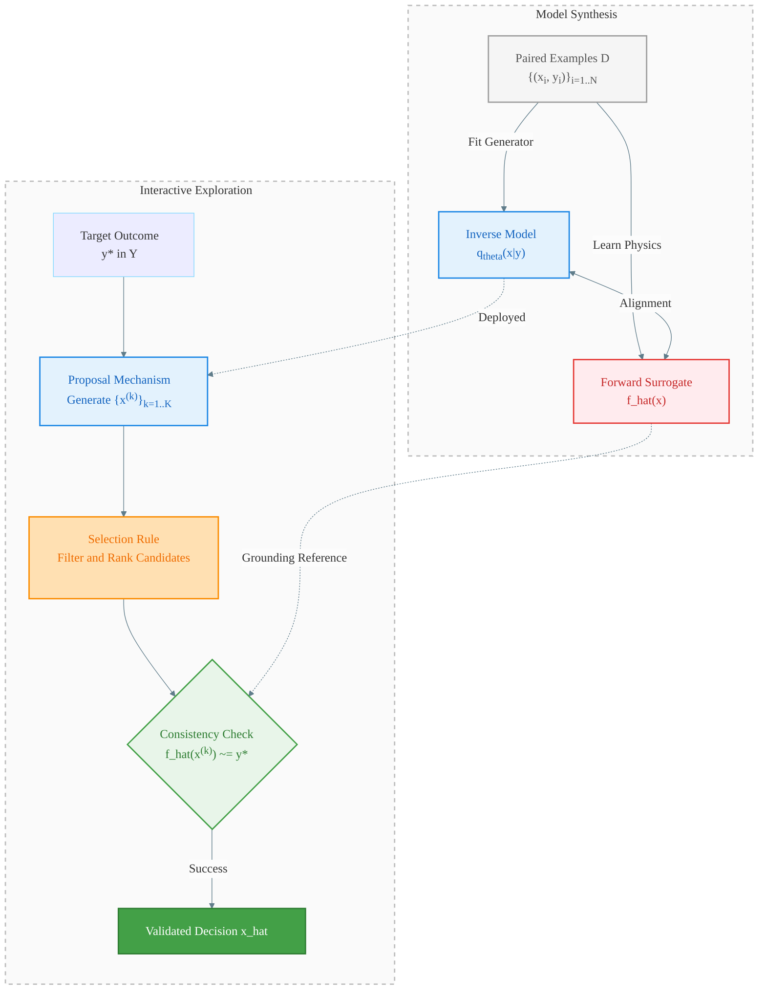

# Framework

```mermaid
%%{init: {
  "theme": "default",
  "themeVariables": {
    "fontFamily": "Inter, Arial, sans-serif",
    "fontSize": "18px",
    "primaryColor": "#E7F6FF",
    "primaryBorderColor": "#0091EA",
    "primaryTextColor": "#1976D2",
    "nodeBorder": "#80D8FF",
    "edgeLabelBackground": "#FCFCFC",
    "clusterBkg": "#F3F8FC",
    "lineColor": "#607D8B"
  },
  "flowchart": {
    "curve": "basis",
    "padding": 20,
    "nodeSpacing": 50,
    "rankSpacing": 90
  }
}}%%

flowchart TD
  subgraph MODEL["Model Synthesis"]
    direction TB
    pairedExamples["Paired Examples D<br/>{(x<sub>i</sub>, y<sub>i</sub>)}<sub>i=1..N</sub>"]
    inverseModel["Inverse Model<br/>q<sub>theta</sub>(x|y)"]
    forwardSurrogate["Forward Surrogate<br/>f_hat(x)"]

    pairedExamples -->|Fit Generator| inverseModel
    pairedExamples -->|Learn Physics| forwardSurrogate
    inverseModel <-->|Alignment| forwardSurrogate
  end

  subgraph INTERACTIVE["Interactive Exploration"]
    direction TB
    targetOutcome["Target Outcome<br/>y* in Y"]
    proposalMechanism["Proposal Mechanism<br/>Generate {x<sup>(k)</sup>}<sub>k=1..K</sub>"]
    selectionRule["Selection Rule<br/>Filter and Rank Candidates"]
    consistencyCheck{"Consistency Check<br/>f_hat(x<sup>(k)</sup>) ~= y*"}
    validatedDecision["Validated Decision x_hat"]

    targetOutcome --> proposalMechanism
    proposalMechanism --> selectionRule
    selectionRule --> consistencyCheck
    consistencyCheck -->|Success| validatedDecision
  end

  inverseModel -.->|Deployed| proposalMechanism
  forwardSurrogate -.->|Grounding Reference| consistencyCheck

  classDef data fill:#F5F5F5,stroke:#9E9E9E,stroke-width:2px,color:#555
  classDef inverse fill:#E3F2FD,stroke:#1E88E5,stroke-width:2px,color:#1565C0
  classDef forward fill:#FFEBEE,stroke:#E53935,stroke-width:2px,color:#C62828
  classDef proposal fill:#E3F2FD,stroke:#1E88E5,stroke-width:2px,color:#1565C0
  classDef selection fill:#FFE0B2,stroke:#FB8C00,stroke-width:2px,color:#EF6C00
  classDef consistency fill:#E8F5E9,stroke:#43A047,stroke-width:2px,color:#2E7D32
  classDef validated fill:#43A047,stroke:#2E7D32,stroke-width:2px,color:#FFFFFF

  class pairedExamples data
  class inverseModel inverse
  class forwardSurrogate forward
  class proposalMechanism proposal
  class selectionRule selection
  class consistencyCheck consistency
  class validatedDecision validated

  style MODEL fill:#FAFAFA,stroke:#BDBDBD,stroke-width:2px,stroke-dasharray: 6 6
  style INTERACTIVE fill:#FAFAFA,stroke:#BDBDBD,stroke-width:2px,stroke-dasharray: 6 6
    
```
