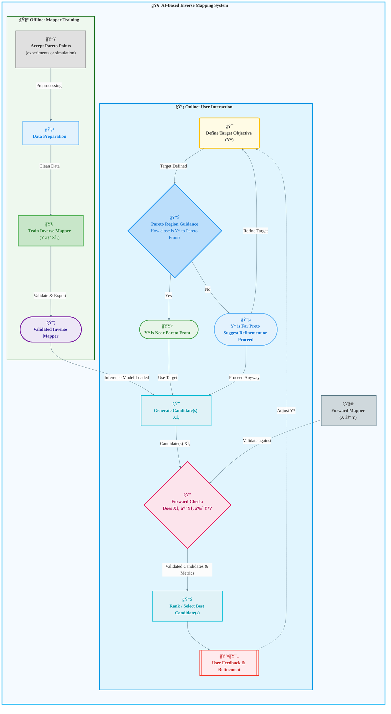

# Framework

```mermaid
%%{init: {
  "theme": "default",
  "themeVariables": {
    "fontFamily": "Inter, Arial, sans-serif",
    "fontSize": "18px",
    "primaryColor": "#E7F6FF",
    "primaryBorderColor": "#0091EA",
    "primaryTextColor": "#1976D2",
    "nodeBorder": "#80D8FF",
    "edgeLabelBackground": "#FCFCFC",
    "clusterBkg": "#F3F8FC",
    "lineColor": "#607D8B"
  },
  "flowchart": {
    "curve": "basis",
    "padding": 20,
    "nodeSpacing": 50,
    "rankSpacing": 90
  }
}}%%

flowchart TD
 subgraph Offline["<b>🧰 Offline: Mapper Training</b>"]
    direction TB
        B["📥<br><b>Accept Pareto Points</b><br>(experiments or simulation)"]
        B2_offline["🧹<br><b>Data Preparation</b>"]
        B1["🧠<br><b>Train Inverse Mapper</b><br>(Y → X̂)"]
        B3_offline(["📦<br><b>Validated Inverse Mapper</b>"])
  end

 subgraph Online["<b>💡 Online: User Interaction</b>"]
    direction TB
        A("ğŸ¯<br><b>Define Target Objective (Y*)</b>")
        C_Online{"📊<br><b>Pareto Region Guidance</b><br>How close is Y* to Pareto Front?"}
        C1(["🟢<br><b>Y* is Near Pareto Front</b>"])
        C2(["🔵<br><b>Y* is Far Preto <br>Suggest Refinement or Proceed</b>"])
        D["ğŸ”<br><b>Generate Candidate(s) XÌ‚"]
        E_all{"ğŸ”<br><b>Forward Check:<br>Does XÌ‚ → YÌ‚ ≈ Y*?</b>"}
        D2["📊<br><b>Rank / Select Best Candidate(s)</b>"]
        F[["👤🔄<br><b>User Feedback &amp; Refinement</b>"]]
  end

 subgraph SYS["<b>🧠 AI-Based Inverse Mapping System</b>"]
    direction TB
        Offline
        F_Model["🧮<br><b>Forward Mapper<br>(X → Y)</b>"]
        Online
  end

    %% Edges with labels
    B -->|Preprocessing| B2_offline
    B2_offline -->|Clean Data| B1
    B1 -->|Validate & Export| B3_offline

    A -->|Target Defined| C_Online
    C_Online -- Yes --> C1
    C_Online -- No --> C2

    B3_offline -->|Inference Model Loaded| D
    C1 -->|Use Target| D
    C2 -->|Proceed Anyway| D
    C2 -->|Refine Target| A

    D -->|"Candidate(s) XÌ‚"| E_all
    E_all -->|Validated Candidates & Metrics| D2
    D2 --> F
    F -.->|Adjust Y*| A

    F_Model -->|Validate against| E_all

    %% Class Styles
    classDef objective fill:#FFFBE5,stroke:#FFC107,stroke-width:3px,color:#333
    classDef inputdata fill:#E0E0E0,stroke:#757575,stroke-width:2px,color:#333
    classDef training fill:#C8E6C9,stroke:#4CAF50,stroke-width:3px,color:#2E7D32
    classDef decision fill:#BBDEFB,stroke:#2196F3,stroke-width:3px,color:#1976D2
    classDef feasible fill:#E8F5E9,stroke:#43A047,stroke-width:2.5px,color:#2E7D32
    classDef farregion fill:#E3F2FD,stroke:#64B5F6,stroke-width:2.5px,color:#1976D2
    classDef processrun fill:#E0F2F7,stroke:#00BCD4,stroke-width:2px,color:#0097A7
    classDef validation fill:#FCE4EC,stroke:#E91E63,stroke-width:2.5px,color:#AD1457
    classDef forwardmodel fill:#CFD8DC,stroke:#607D8B,stroke-width:2px,color:#424242
    classDef feedback fill:#FFEBEE,stroke:#F44336,stroke-width:2.2px,color:#C62828
    classDef preprocessing fill:#E3F2FD,stroke:#42A5F5,stroke-width:2px,color:#1E88E5
    classDef model_ready fill:#EDE7F6,stroke:#7B1FA2,stroke-width:3px,color:#311B92

    class A objective;
    class B inputdata;
    class B2_offline preprocessing;
    class B1 training;
    class B3_offline model_ready;
    class C_Online decision;
    class C1 feasible;
    class C2 farregion;
    class D processrun;
    class D2 processrun;
    class E_all validation;
    class F feedback;
    class F_Model forwardmodel;

    style Offline fill:#EEF8EE,stroke:#2E7D32,stroke-width:2px
    style Online fill:#E1F5FE,stroke:#039BE5,stroke-width:2px
    style SYS fill:#F5FAFF,stroke:#14B4F4,stroke-width:3px
    
```
