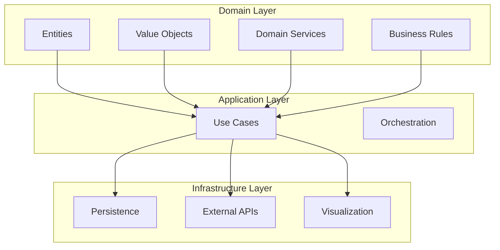

# 🧠 AI Inverse Mapping System Design

## Purpose

This system enables inverse mapping from objective values (Y) to decision variables (X) using AI models, leveraging historical Pareto-optimal data, interpolation, and generative techniques.

---

## Main Architecture (Mermaid Diagram)

---

## Architectural Overview

- **Domain-Driven Design (DDD):**
  - Separation of domain, application, and infrastructure layers.
  - Domain layer contains entities, value objects, services, and business rules.
- **Inverse Mapping Pipeline:**
  1. User specifies target objective Y*.
  2. System normalizes Y*.
  3. Feasibility check (LSNF).
  4. Predict X* via inverse interpolator.
  5. Denormalize X*.
  6. Evaluate f(X*).
  7. If infeasible, suggest alternatives.
- **Feasibility Checking:**
  - Local Spherical Neighborhood Feasibility (LSNF): A point is feasible if it lies within any sphere around normalized Pareto points.
- **Modeling Approaches:**
  - Deterministic: Clough-Tocher, Kriging, Linear, NN, RBF, Spline, SVR.
  - Probabilistic: Gaussian Process, Conditional VAE.
- **Visualization:**
  - Interactive metrics and results using Plotly.
- **Diagrams:**
  - C4 diagrams for system process, VAE training/testing, interpolation.

---

## Key Design Principles

- Modularity, maintainability, and testability.
- Extensibility for new models and validation strategies.
- Clear separation of business logic and technical concerns.

---

## Additional Information

- **Technologies:** Python, Plotly, scikit-learn, PyTorch/TensorFlow, Mermaid.
- **Data:** Historical Pareto-optimal datasets, synthetic benchmarks.
- **Extensibility:** Designed for easy integration of new models, validation strategies, and visualization tools.
