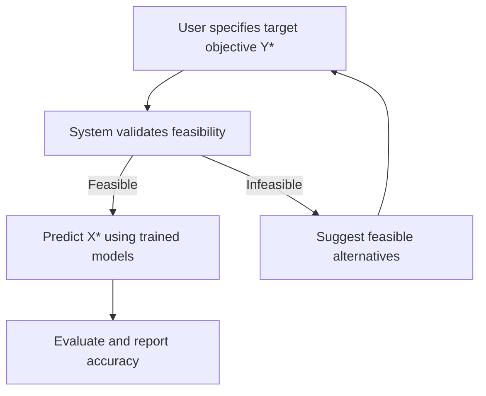

# 📋 Requirements for AI Inverse Mapping System

## Requirements Process (Mermaid Diagram)

---

## Functional Requirements

- Allow users to specify target objectives (Y*).
- Validate feasibility of Y* using LSNF or similar methods.
- Predict decision variables (X*) using trained inverse models.
- Evaluate and report the accuracy of predictions.
- Suggest feasible alternatives if the target is infeasible.
- Support multiple model types and validation strategies.

---

## Non-Functional Requirements

- Modular, maintainable, and testable architecture (DDD).
- Extensible for new models and validation strategies.
- Interactive visualization of results and metrics.
- High performance and scalability for large datasets.
- Secure handling of user data and model outputs.

---

## Data Requirements

- Access to historical Pareto-optimal data.
- Support for normalization/denormalization of objectives and decisions.
- Ability to import/export datasets and model results.

---

## Usability Requirements

- Clear user interface for specifying objectives and viewing results.
- Documentation and diagrams for system workflows.
- User guides and API references for developers.

---

## Additional Information

- **Technologies:** Python, Plotly, scikit-learn, PyTorch/TensorFlow, Mermaid.
- **Metrics:** MSE, MAE, feasibility scores, diversity metrics.
- **Extensibility:** Designed for easy integration of new models, validation strategies, and visualization tools.
