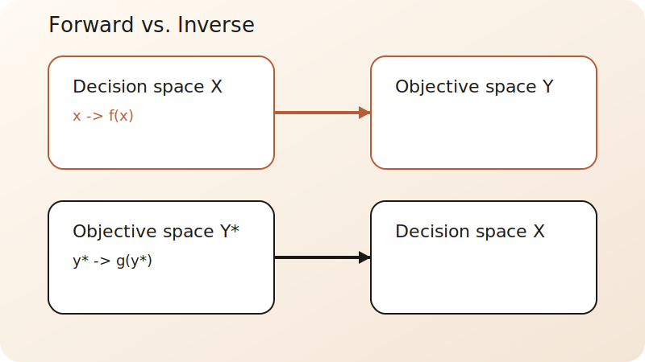
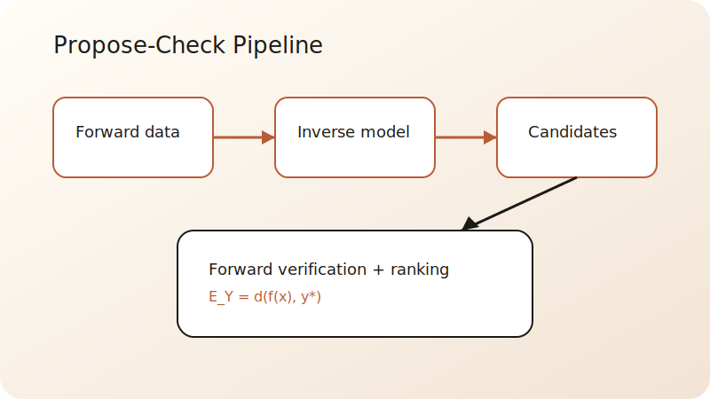
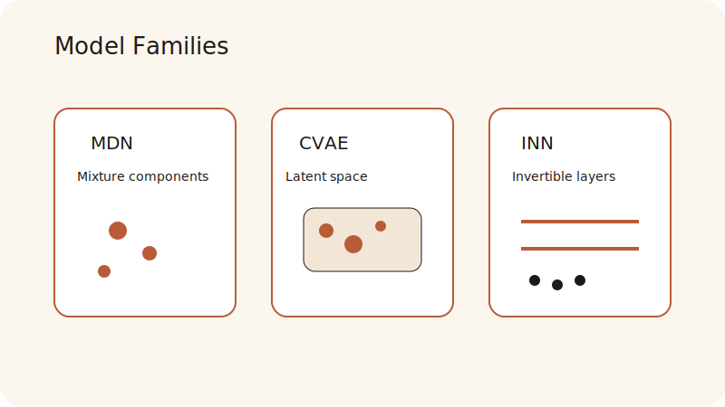
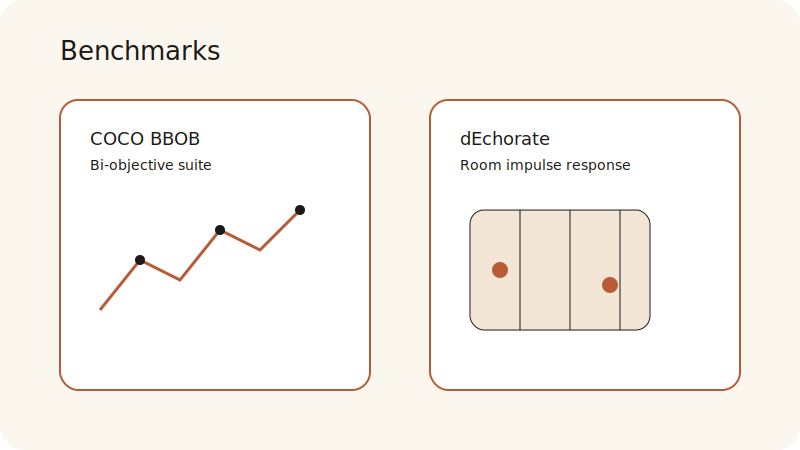

<!--
  Slide content lives here. Use `---` for horizontal slides and `--` for vertical stacks.
  Speaker notes start with "Note:".
-->

<!-- .slide: class="title-slide" data-transition="zoom" -->

  

    
Master Thesis Presentation

    

      <h1 class="font-display leading-tight text-ink">Tracing the Objectives Backwards</h1>
      <h3 class="font-sans text-[0.9em] tracking-[0.02em] font-medium text-slate-600">Data-Driven Inverse Exploration of Multi-Objective Problems</h3>
    

  

  
  

    

      

        
Author

        
Nicola Ibrahim

        
M.Sc. Computer Engineering

      

      

        
Institution

        
Paderborn University

        
January 5, 2026

      

    

  

Note: Welcome everyone. Today I'm presenting my thesis on inverse design—learning to map desired performance targets back to the decisions that produce them.

---

<h2 class="slide-title">Agenda</h2>

  

    

      
01

      
Motivation & Problem

    

    

      
02

      
Inverse-Design Workflow

    

    

      
03

      
Models & Evaluation

    

  

  

    

      
04

      
Experiments & Results

    

    

      
05

      
Contributions & Outlook

    

  

---

<!-- .slide: data-auto-animate -->
<h2 class="slide-title">Motivation: Turning Design Upside-Down</h2>

  

    
Designers start with <strong>performance templates</strong>, not parameters:

    <ul class="space-y-4">
      <li class="fragment fade-up"><strong>Audio:</strong> Prescribed frequency-response shape.</li>
      <li class="fragment fade-up"><strong>Antennas:</strong> Specific spatial beam patterns.</li>
      <li class="fragment fade-up"><strong>Robotics:</strong> Target rate-distortion operating points.</li>
    </ul>
    

      Forward simulation is easy; <strong>inverse decision-making</strong> is the bottleneck.
    

  

  

    

      
The Inverse Challenge

      
Ill-posedness, non-uniqueness, and high-dimensional search spaces make "manual" trial-and-error impractical.

    

    
  

Note: In practice, we know what we want (outcomes) but not how to get there (decisions).

---

<!-- .slide: data-auto-animate -->
<h2 class="slide-title">Problem Statement</h2>

  

    
Given forward map $f: X \to Y$ and samples $(x_i, y_i) \in \mathcal{D}$:

    <h3 class="text-xl font-bold">The Goal</h3>
    
Learn a data-driven inverse rule $\hat{g}: Y \to X$ that proposes <strong>multiple candidate decisions</strong> $\hat{x}$ for a target $y^*$.

  

  

    

      
Non-uniqueness

      
Many $x$ can yield the same $y^*$.

    

    

      
Infeasibility

      
Some $y^*$ have no preimage in $X$.

    

    

      
Stability

      
Small $\Delta y^*$ can cause large $\Delta x$.

    

  

Note: We need models that can output multiple distinct candidates to handle this ambiguity.

---

<h2 class="slide-title">The Propose-Check Workflow</h2>

  

    <ol class="space-y-2">
      <li class="fragment fade-left" data-fragment-index="1">
        Offline: Collect evaluations and train $\hat{g}(y)$.
      </li>
      <li class="fragment fade-left" data-fragment-index="2">
        Query: Input $y^*$, sample $K$ candidates $\{\hat{x}_1, \dots, \hat{x}_K\}$.
      </li>
      <li class="fragment fade-left" data-fragment-index="3">
        Verify: Evaluate $f(\hat{x}_k)$ forward.
      </li>
      <li class="fragment fade-left" data-fragment-index="4">
        Rank: Select best candidate by discrepancy.
      </li>
    </ol>
    

      
"Computational effort shifts from query-time search to one-time offline training."

    

  

  

---

<!-- .slide: data-auto-animate -->
<h2 class="slide-title">Modeling Multi-Valued Maps</h2>

  

    <h3 class="font-display text-lg">MDN</h3>
    
<strong>Mixture Density Networks</strong>

    
Approximates $p(x|y)$ as a mixture of Gaussians. Captures distinct modes explicitly.

  

  

    <h3 class="font-display text-lg">CVAE</h3>
    
<strong>Conditional VAEs</strong>

    
Learns a latent distribution $z$ conditioned on $y$. High diversity through latent sampling.

  

  

    <h3 class="font-display text-lg">INN</h3>
    
<strong>Invertible Neural Nets</strong>

    
Uses bijective architecture to preserve information. Latent space padding handles ill-posedness.

  

  

---

<!-- .slide: data-auto-animate -->
<h2 class="slide-title">Evaluation: Outcome-Space Metrics</h2>

  

    

      
Outcome Discrepancy

      
$E_Y = \|f(\hat{x}) - y^*\|^2$

      
Primary measure of target alignment.

    

    

      
Success Rate ($Succ_\epsilon$)

      
Targets within tolerance $\epsilon$.

      
Fraction of queries considered "close enough".

    

  

  

    
The "Best-of-K" Principle

    
We assess the <strong>best possible design</strong> the user can choose from the candidate set.

    

      

    

    
Quality scales with candidate set size $K$.

  

Note: Emphasize that we evaluate in objective space because that's what the user cares about.

---

<!-- .slide: data-auto-animate -->
<h2 class="slide-title">Experimental Benchmarks</h2>

  

    

      
01

      

        <h3 class="text-ink mb-1">COCO BBOB (Synthetic)</h3>
        
Bi-objective test suite with complex trade-off surfaces and non-convex Pareto fronts.

      

    

    

      
02

      

        <h3 class="text-ink mb-1">dEchorate (Real-World)</h3>
        
Acoustic room geometry design. Mapping reverb/echo profiles to 3D sensor positions.

      

    

  

  

---

<!-- .slide: data-auto-animate -->
<h2 class="slide-title">Results: Pareto Alignment</h2>

  

    <ul class="space-y-4">
      <li class="fragment fade-right">
        <strong>High Precision:</strong> Inverse models reach targets with error lower than grid-search baseline.
      </li>
      <li class="fragment fade-right">
        <strong>Power of K:</strong> Increasing $K$ from 1 to 50 significantly boosts $Succ_\epsilon$.
      </li>
      <li class="fragment fade-right">
        <strong>Generalization:</strong> CVAE shows superior robustness on out-of-distribution targets.
      </li>
    </ul>
    

      Models learn the "Pareto skeleton" of the design space.
    

  

  

    
    
Comparison of target specs vs. forward-evaluated results.

  

---

<h2 class="slide-title">Key Contributions</h2>

  

    
01. Formalization

    
Unified framing of data-driven inverse design for multi-objective signal processing.

  

  

    
02. Protocol

    
Reproducible "Best-of-K" evaluation pipeline with explicit forward verification.

  

  

    
03. Empirical Insights

    
Detailed characterization of trade-offs between alignment, diversity, and computational cost.

  

---

<h2 class="slide-title">The Road Ahead</h2>

  

    

      <h3 class="text-accent">Reliability</h3>
      
Integrating <strong>Operational Domain Validators</strong> (ODD) to detect out-of-distribution targets.

    

    

      <h3 class="text-brand">Scalability</h3>
      
Extending to outcome spaces with $D > 10$ using hierarchical latent models.

    

  

  

    
Final Takeaway

    

      Inverse modeling turns passive datasets into <strong>active design assistants</strong>, enabling designers to trace their objectives backwards with mathematical confidence.
    

  

---

  <h1 class="text-5xl font-display text-ink">Thank You</h1>
  

    <h3 class="text-accent uppercase tracking-widest font-bold">Questions?</h3>
    
Tracing the Objectives Backwards

  

  
  

    
Theory

    
Data

    
Design

  

Note: Thank you for your attention. I'm now open for any questions regarding the methodology or results.
